## Overview

PointEdgeSegNet is the lightweight 3D point cloud segmentation model based on EdgeConv, Transforer and U-Net architecture. This project has purpose of researching and developing 3D point cloud segmenation model in [3D Scan to BIM pipeline](https://github.com/mac999/scan_to_bim_pipeline), [3D scan to Model](https://github.com/mac999/scan_to_model_pipeline) development that can classify each point in large-scale 3D PCD into semantic categories such as ceiling, floor, wall, furniture, and other industry objects which you can customize easily under small size VRAM like 24GB under. This is a personal project that I develop in my spare time, but if you're interested, you're welcome to join me in developing it at any time.

Although many research and open-source models exist for PCD segmentation, they have been challenging to use in practice. For example, some SOTA models in this research field use lots of GPU with VRAM, so it's difficult to train the models for industry. They have issues under the limited VRAM like 24 GB, large dataset processing in specific industry domain etc. When processing large PCD files, open-source models often did not perform as well as claimed in papers or required additional development to handle them. Some model codes were too outdated to be installed and run in current development environments. Some open-source models had overly complex structures and modules, making them difficult to modify for specific purposes. Models that consumed excessive GPU resources were problematic in practice. Some models used specialized libraries or file formats for training, limiting their overall usability. Few similar projects had well-documented learning and training methods. This project strives to address these issues to the best of its ability.

The current backbone (v2, `models/stencil.py`) voxelizes the input once and keeps every stage on a voxel lattice, so spatial neighbourhoods are looked up at fixed lattice offsets instead of searched — kNN-quality local geometry at a fraction of the cost. Local features are aggregated with point-wise MLPs plus relative-position and feature-difference encodings inside a U-Net encoder-decoder, and a lightweight Transformer at the bottleneck preserves global context across scales. The original EdgeConv backbone (v1, `models/edgeconv.py`) is kept as a legacy path. This approach enables accurate semantic segmentation of complex indoor scenes. 

PointEdgeSegNet supports large-scale point cloud training, custom dataset and segmentation inference. Any point cloud format that can be used for training, such as files generated by a matterport or lidar scanner in the <X,Y,Z,R,G,B> format, can be used for training.

### Benefits

- **Runs on ≤24 GB VRAM — no server-class GPUs.** Trains and infers on a single consumer/pro card. SOTA sparse-conv/transformer models do not magically fit whole clouds either — they down-voxelize (losing fine detail) or tile with hundreds of sliding windows; this model chunks by design instead.
- **Scales to arbitrarily large clouds.** Space is split into fixed-size blocks (constant memory per block, linear scaling), so a 100M-point LAS scan is handled like a single room — every point is covered at full density, not coarse-voxelized.
- **Lightweight yet competitive.** ~3.0M parameters (about 1/5 of KPConv) reaching S3DIS Area-5 **OA 87.8% / mIoU 64.8%** — past RandLA-Net and within 0.6 of MinkowskiNet, at a fraction of the compute and with no compiled extensions.
- **Practical & self-contained.** Any `X Y Z [R G B ...]` cloud, custom classes via one JSON, standard deps (PyTorch/PyG/Open3D), and colored **LAS** output for direct viewing (CloudCompare, etc.).
- **Honest evaluation.** Reports OA / mAcc / **mIoU** on a truly held-out area with leakage-controlled spatial train/val splits, plus multi-view voting, TTA and model-ensemble inference.

<p align="center">
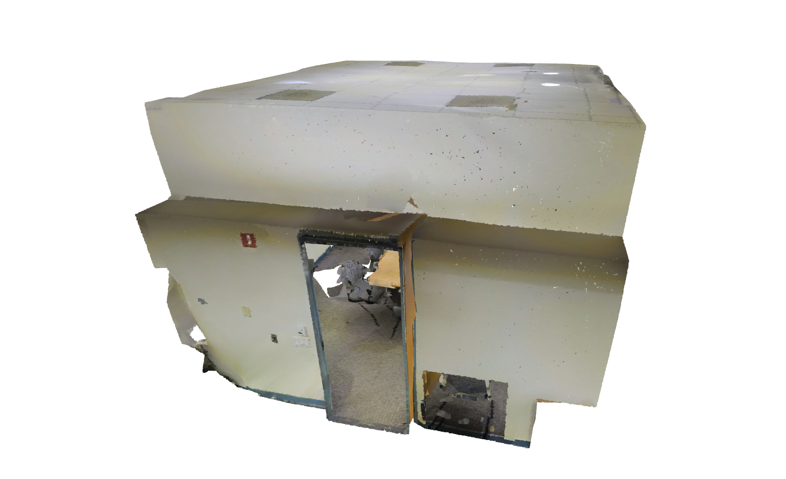</img>
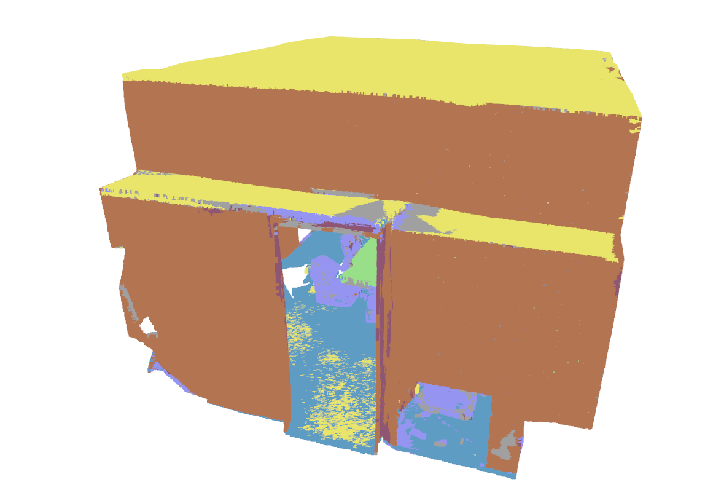</img>
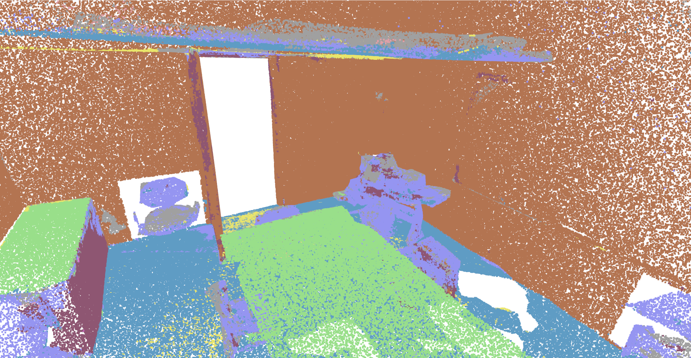</img></br>
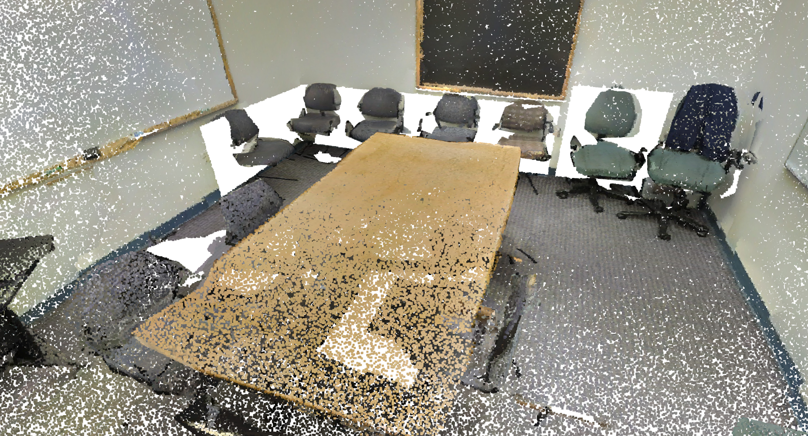</img>
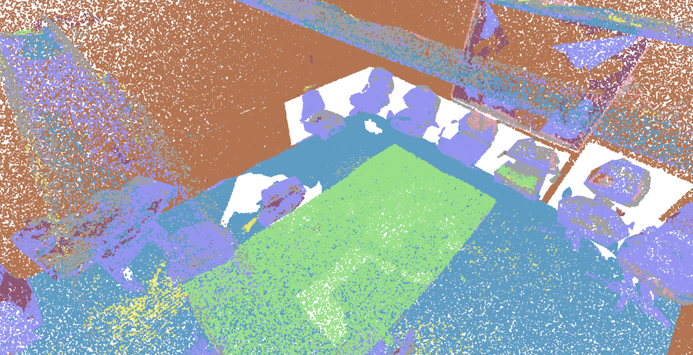</img></br>
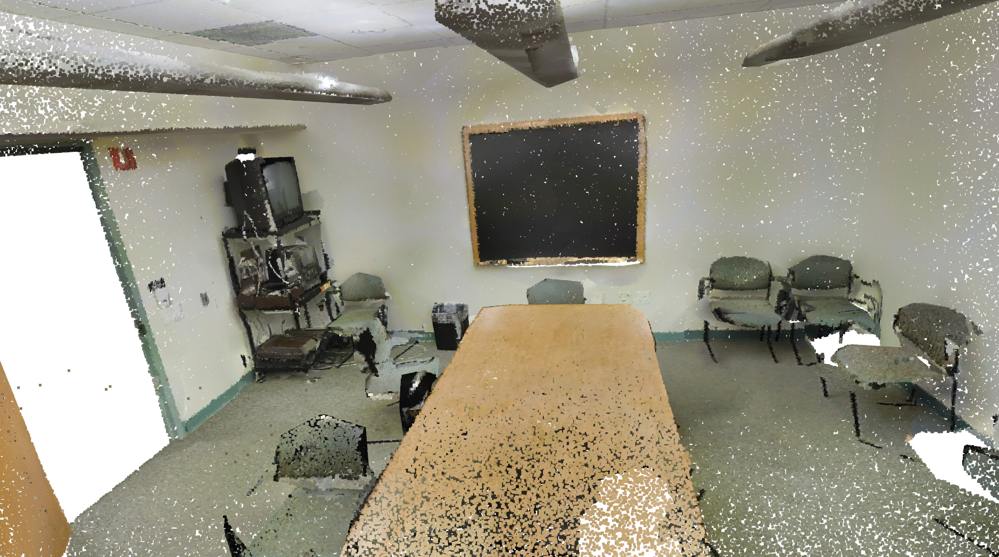</img>
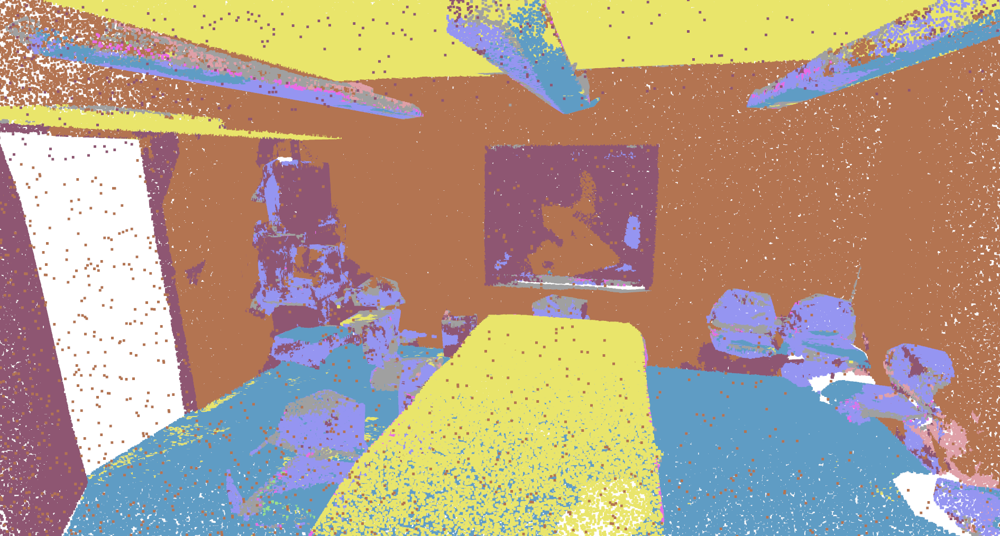</img>
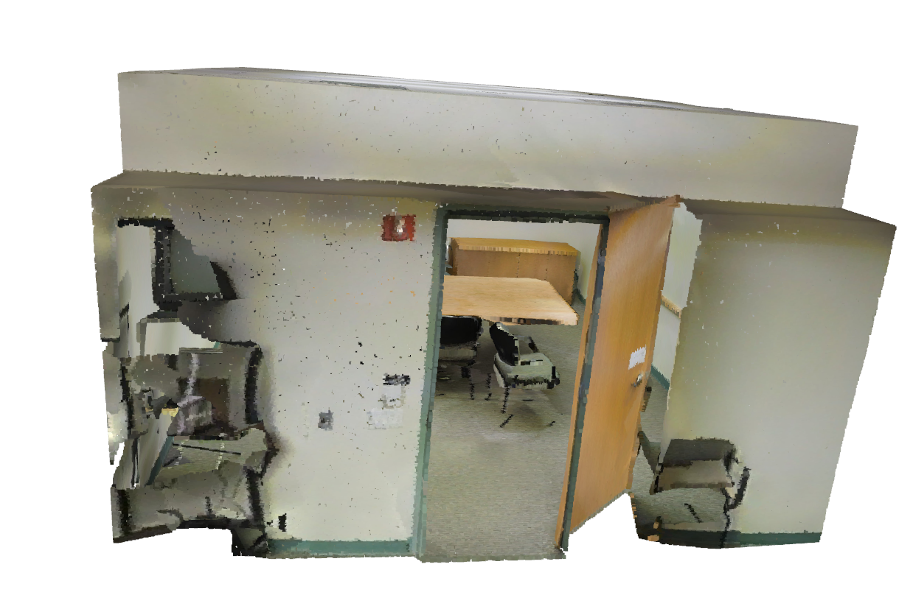</img>
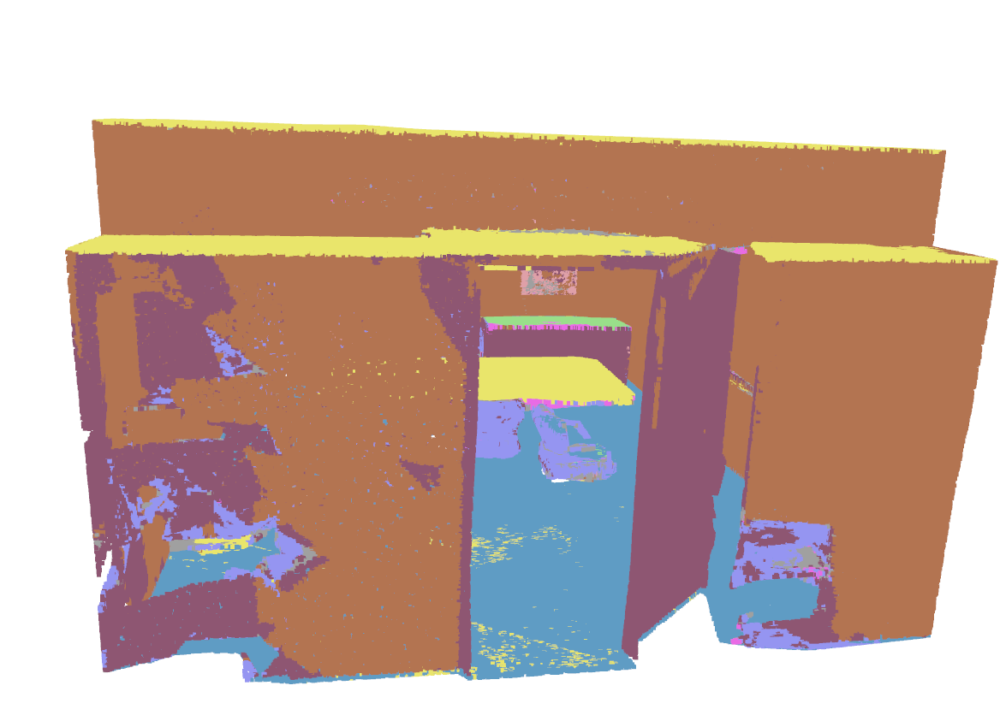</img></br>
</p>
<p align="center">Example. Input point cloud and segments in output results using PointEdgeSegNet model. Latest S3DIS Area 5 (held-out, v2 architecture): OA=87.8%, mAcc=72.6%, mIoU=64.8% with 8-view TTA (64.2 single view). Trains within 24GB VRAM.)
</p>


## Version

- 0.1: 2025/9/21. Draft version.
- 0.2: 2025/9/24. CLI args, bug fixed.
- 0.3: 2025/9/26. GPU safety mode was added.
- 0.4: 2025/9/28. Diagnose was added. Points grid generation using grid hash spatial indexing
- 0.5: 2025/10/1. Train dataset development (area 1 to 6)
- 0.6: 2025/10/3. Hyperparameter finetuning (support VRAM 8GB, 24GB) and Dataset augumentation (e.g. on the fly)
- 0.7: 2025/12/30. Integrate Attention Mechanism, Focal Loss, Area 5 test
- 0.8: 2026/1/17. Update source code and [model file](https://github.com/mac999/point_edge_seg_net/tree/main/logs/20260113_231712).
- 0.9: 2026/2/1. Support custom train dataset with classes of points. Please refer to [model_params.json](./model_params.json).
- 1.0: 2026/7/7. Major accuracy & large-cloud overhaul — S3DIS Area 5: **OA 86.2% / mAcc 69.0% / mIoU 59.6%** ([logs](./logs/20260707_101907)):
  - **Context-preserving `column` block mode** (overlapping full-height columns) with a leakage-controlled *spatial* train/val split (replaces context-losing grid cells).
  - **Coverage-guaranteed inference blocking + fixed multi-view voting** — dense/large clouds no longer collapse to a single class (uncovered points were silently labelled `ceiling`; now every point is predicted and voted).
  - **Lovász-Softmax + Focal loss** (directly optimizes mIoU, not just accuracy) and **per-block coordinate centering** (translation invariance → smaller train/test gap).
  - **Curvature feature fix** (true local surface-variation edge cue instead of a near-constant legacy channel), wider EdgeConv receptive field (**k=32**), **2-layer bottleneck Transformer**.
  - New: **mIoU / mAcc metrics**, **TTA (Z-rotation) + model-ensemble inference**, **colored LAS export**, early-stopping aligned to the checkpoint metric.
- 1.1: 2026/7/15. AMP training bug fix & retrain — S3DIS Area 5: **OA 86.60% / mAcc 69.73% / mIoU 59.99%** ([logs](./logs/20260715_204942)):
  - **Fixed a GradScaler state-corruption bug**: the "very large gradient → skip batch" branch called `scaler.unscale_()` without a matching `scaler.update()`, so from the first skipped batch onward every optimizer step silently failed (`unscale_() has already been called…`), permanently freezing the weights. The skip branch now resets the scaler state, restoring correct AMP training.
  - Retrained the v1.0 configuration (column mode, 60 epochs, batch 10, effective batch 60) with the fix — all metrics improved over the 20260707 baseline (OA +0.44, mAcc +0.68, mIoU +0.42); best validation accuracy 93.59%.
  - Added `run_train_global.bat` to reproduce the training run.
- 2.0: 2026/8/21. **Architecture rework (v2) — S3DIS Area 5: OA 87.8% / mAcc 72.6% / mIoU 64.8%** (full-coverage protocol, +4.8 mIoU over v1.1 re-scored identically). Checkpoints are **not** compatible with v1.
  - **New backbone `models/stencil.py`**: per-layer kNN graph search is removed entirely. Neighbours are looked up on the voxel lattice with a fixed stencil (sorted keys + binary search), local aggregation is a point-wise MLP with a relative-position encoding and a feature-difference term, and down/upsampling use grid pooling with an exact inverse map. U-Net layout, feature gate and bottleneck Transformer are kept.
  - **Speed / memory**: ~7x faster training epochs and ~3x lower training memory than v1 at equal settings; single-view inference runs in about 4 GB. Training fits a 24 GB card (see Training below).
  - **Grid-preserving TTA** for evaluation (8 views: 90-degree rotations x mirror), matching the lattice assumption of the stencil.
  - Architectures are registered by name in `models/` (`edgeconv` = legacy v1, `stencil` = current); select with `--arch` in `train_model.py` and `evaluate_full.py`. Checkpoints are not interchangeable between the two.


Optimization strategy under 24GB VRAM constraints (boundary artifacts, class imbalance, generalization):
* **Overlapping context-preserving blocks:** `column` mode builds overlapping full-height columns instead of context-losing cubic grid cells, preserving the topology of objects (e.g., columns/doors) bisected by grid boundaries.
* **Coordinate normalization:** per-block coordinate centering (translation invariance) inside the model, applied identically at train and inference — improves generalization to unseen areas.
* **mIoU-aware loss:** Lovász-Softmax combined with Focal loss directly optimizes per-class IoU, lifting rare classes without a recall-only bias.
* **Multi-view voting inference:** predictions from overlapping/rotated (TTA) blocks are aggregated per point to suppress boundary noise; a coverage-guaranteed blocker ensures every point of large/dense clouds is predicted.
* **Curvature feature fix + wider receptive field (k=32) + 2-layer bottleneck Transformer** for stronger local/global context.

Still open (future work):
* **Global Context Injection:** append normalized global Z to features to better separate height-dependent classes (e.g., beam vs. sofa).
* **Copy-Paste Augmentation:** copy rare-class points into wall-dominated blocks to further address imbalance (currently the two rarest classes, `column`/`sofa`, remain the mIoU bottleneck).

<p align="center">
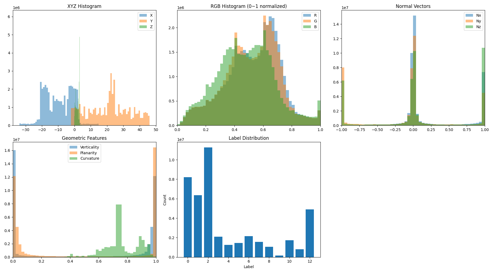</img>
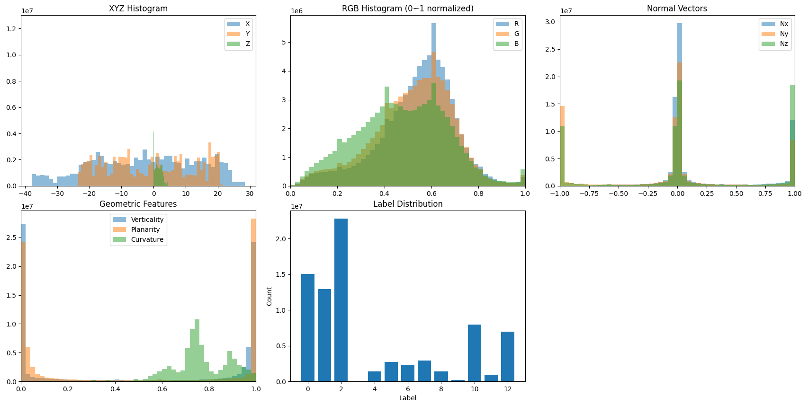</img>
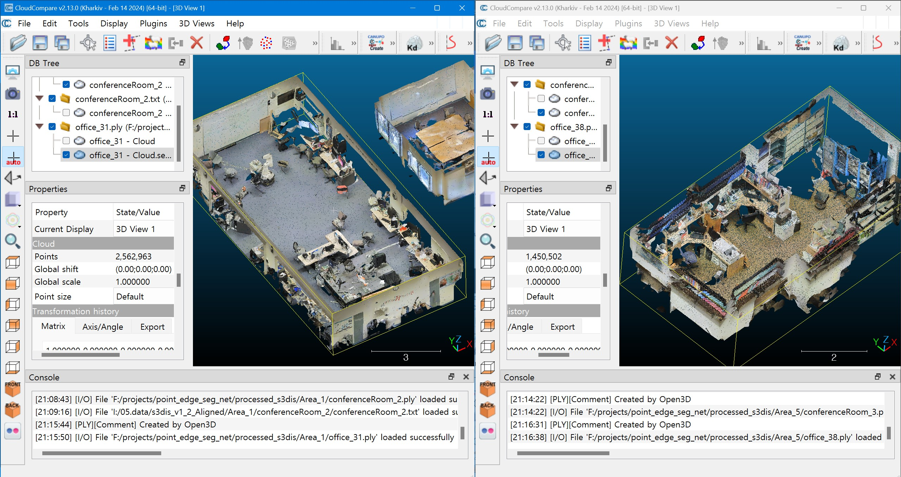</img>
</p>

## Architecture v2 (models/stencil.py)

Version 2.0 replaces the training/inference backbone. To avoid confusion:

| | v1 (legacy) | v2 (current) |
|---|---|---|
| Module | `models/edgeconv.py` | `models/stencil.py` |
| Class name | `PointEdgeSegNet` | `PointEdgeSegNet` (same name; the module path disambiguates) |
| Neighbourhoods | kNN graph per layer (`knn_graph`) | fixed voxel-stencil lookup (no search) |
| Local aggregation | EdgeConv (per-edge MLP) | point-wise MLP + relative-position encoding + feature-difference term, max pooling |
| Down / upsampling | FPS or grid ratio + kNN interpolation | grid pooling with exact inverse map |
| Checkpoints | v1 only | v2 only (not interchangeable) |
| Select with | `--arch edgeconv` | `--arch stencil` (plus `--v2_*` options); `v1`/`v2` accepted as aliases |

Architectures live under `models/` and are named after what they are, not after a version number — a future backbone is one new module plus one registry entry in `models/__init__.py`. `model.py` and `model_v2.py` remain as import shims for older scripts. Both paths share the same data pipeline, losses, and evaluation protocol. The key idea of v2: because the input is voxelized and every pooling stage stays on a voxel lattice, a point's spatial neighbours can be looked up at fixed lattice offsets (sorted integer keys + binary search) instead of searched — kNN-quality neighbourhoods at serialization-level cost.

### Training with v2

```bash
export PYTORCH_CUDA_ALLOC_CONF=expandable_segments:True   # recommended; tames allocator growth

python train_model.py \
    --config model_params_room.json \
    --processed_data_path ./processed_s3dis --block_data_path ./chunk_s3dis \
    --block_size 20480 \
    --train_areas Area_1 Area_2 Area_3 Area_4 Area_6 --test_area Area_5 \
    --num_epochs 600 \
    --arch stencil --v2_neighbors stencil --v2_stencil 2 --v2_diff \
    --enc_channels 64,192,320,448 --bottleneck_dim 256 \
    --batch_size 4 --val_batch_size 4 --learning_rate 0.003 \
    --block_mode column --sampler grid \
    --focal_gamma 2.0 --oversample_rare 1.0 --aug_preset strong
```

On a 24 GB card the same command fits with `--val_batch_size 2`; use `--batch_size 2` for extra headroom (roughly 8-10 GB, ~1.7x slower). Cosine schedule with early stopping typically ends near epoch 520.

### Evaluation (full-coverage protocol)

```bash
python evaluate_full.py --model_weights logs/<run>/final_model.pth \
    --config model_params_room.json --mode chunk --sampler grid \
    --block_size 20480 --core_max 12288 --halo 1.0 \
    --arch stencil --v2_neighbors stencil --v2_stencil 2 --v2_diff \
    --enc_channels 64,192,320,448 --bottleneck_dim 256 \
    --tta_d4 8
```

Architecture flags must match training. `--tta_d4 8` enables grid-preserving test-time augmentation (four 90-degree rotations x mirror); scale-based TTA is intentionally not used because it would break the voxel lattice the stencil relies on. Evaluate `final_model.pth` as well as `best_model.pth` — validation-based selection does not reliably pick the better test model on this benchmark.

### Experimental: block-context (buffered wide-area) features

Enable with `--block_context` on `train_model.py` / `inference.py`, or `"features": {"use_block_context": true}` in `model_params.json`.

Blocks are sized for VRAM, so the model never sees what lies *around* a block — the "long-range context between blocks" bottleneck named above. Instead of enlarging blocks (which costs VRAM), each block's XY bounds are expanded by `context_buffer` metres and the points of **neighbouring blocks** inside that buffer are aggregated into a small statistics vector: horizontal/vertical surface shares (from normals), mean surface variation (edge-ness), block/buffer density ratio, and a normalized Z-histogram (`context_bins`). This vector is appended to every point of the block as constant channels (default 10D → 18D), so the network learns each point's label *conditioned on a wide-area summary* — at zero VRAM cost (input channels only, ≈+4K params) and computed once at block-build time.

Related work (input-level context injection): PointNet's per-block normalized room-global coordinates, Engelmann et al. 2017 (enlarged/multi-scale block context), SCF-Net's global contextual features (CVPR 2021), classical multi-scale eigenfeatures (verticality etc., Weinmann et al. 2015 / Hackel et al. 2016), and the buffered-tile ("halo") practice of large-scale GIS point-cloud pipelines. This option combines the buffered-tile idea with handcrafted wide-area statistics as block-constant input channels.

A/B comparison (block caches are kept separate automatically — the context run writes to `<block_data_path>_ctx`):

```bash
# baseline (identical to current pipeline)
python train_model.py --no_block_context --no_wandb
# with block context (2 m buffer, 4 z-histogram bins)
python train_model.py --block_context --context_buffer 2.0 --context_bins 4 --no_wandb
# inference feature layout must match how the model was trained
python inference.py --block_context -m ./logs/<ctx_run>/best_model.pth -i ./sample/area_6_conferenceRoom_1.txt
```

Notes: the shipped weights are 10D, so enabling context requires retraining; a stale block cache with the wrong feature width is detected and reported with an actionable error.

The following items already apply in 24GB VRAM:
- **Increased depth**: 2-layer bottleneck Transformer added on top of the EdgeConv U-Net (bottleneck operates on the downsampled set, so extra depth costs almost no memory).
- **Tuned k-NN**: `EdgeConv` neighbourhood raised to `k=32` (batch/accumulation adjusted so training fits a 24 GB card — measured whole-GPU peak ~18.7 GB — with the effective batch kept at 60).
- **LR warm-up + Cosine annealing**: linear warm-up precedes `CosineAnnealingLR` (`T_max = num_epochs`, so the LR fully anneals by the last epoch).
- **AdamW optimizer** with weight decay for better generalization.

## Features

- Large-scale point cloud training and segmentation
- Edge-based convolution layers for capturing local geometric relationships
- U-Net encoder-decoder architecture with skip connections
- Lightweight Model Architecture with Transformers
- Block-based processing for memory efficiency. Here, the concept of a block refers to a unit of point cloud file that divides a large number of point clouds, such as 100 million, into units that enable model learning and prediction within VRAM.
- Support for S3DIS dataset preprocessing and training
- Inference with 3D visualization of Large-scale point cloud file
- Comprehensive logging and model checkpointing
- Converting 3D model file (IFC) to 3D point cloud file (LAS) to develop train dataset.
- `column` (context-preserving, overlapping full-height) and `grid` block modes, with leakage-controlled spatial train/val split
- Coverage-guaranteed inference with multi-view voting, test-time augmentation (TTA), and model ensembling — safe for large/dense clouds
- OA / mAcc / **mIoU** evaluation (standard S3DIS metric) reported to console and JSON
- Lovász-Softmax + Focal loss and in-model per-block coordinate normalization for accuracy under limited VRAM
- Colored **LAS** export (per-class RGB + `classification` field) for direct viewing in CloudCompare, etc.

## Performance Log

Latest (v2.0 architecture, `model_v2.py`), S3DIS with Area 5 held out for test. Scoring uses the full-coverage protocol: every one of the 78.4M original points of Area 5 is predicted and scored (`evaluate_full.py`).

| Metric | Value |
|--------|-------|
| Mean IoU (mIoU) | **64.8%** (8-view TTA) / 64.2% single view |
| Overall Accuracy (OA) | **87.8%** |
| Mean Class Accuracy (mAcc) | **72.6%** |
| Parameters | ~3.0M |
| Training | 600-epoch schedule, ~2 min/epoch on one GPU; fits a 24 GB card (see Training with v2) |
| Inference GPU memory | ~4 GB, constant in cloud size (chunked) |

<p align="center">
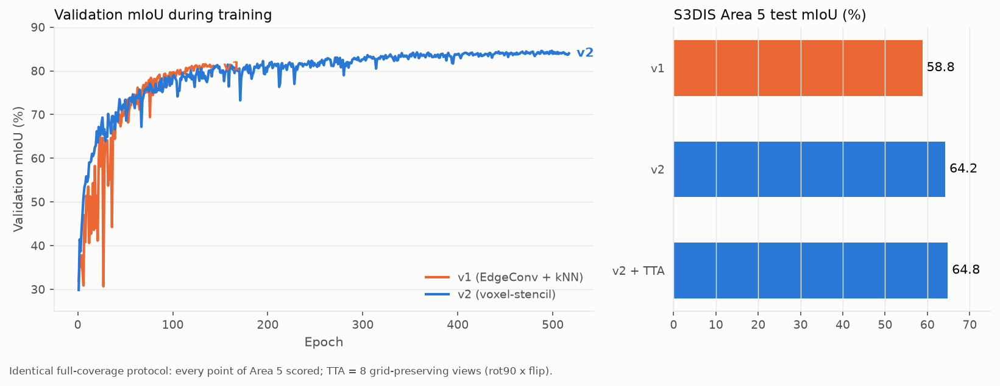</img></br>
Training curves and Area-5 test results, v1 vs v2 under the identical protocol.
</p>

<p align="center">
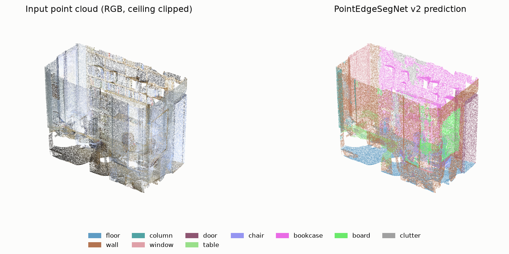</img></br>
Inference example: Area 5 office_1 (816K points, held out from training), chunked v2 inference with 8-view TTA; 83.6% point accuracy on this room.
</p>

For reference, the v1 architecture re-scored under this same protocol reaches mIoU 58.8 — the published v1.1 figure (mIoU 59.99, `logs/20260715_204942`) used the earlier block-sampled protocol and is not directly comparable.

- [Train Model Performance](./logs/20260715_204942/training_summary.json)
- [Test Data Prediction Performance](./logs/20260715_204942/test_summary.json)
- [Trained model and Log files](./logs/20260715_204942). Train/Val (spatial split) and Test on S3DIS v1.2 aligned.
- Previous baseline (v1.0): OA 86.16% / mAcc 69.05% / mIoU 59.57% ([logs/20260707_101907](./logs/20260707_101907))

Per-class IoU highlights (Area 5, v2 + TTA): floor 96.9, ceiling 91.5, chair 88.7, wall 81.6, table 80.4, door 70.6, sofa 70.3 — `column` (27) and `beam` (0; Area 5 contains almost no beam points, 0.03%) remain the weakest classes.

<p align="center">
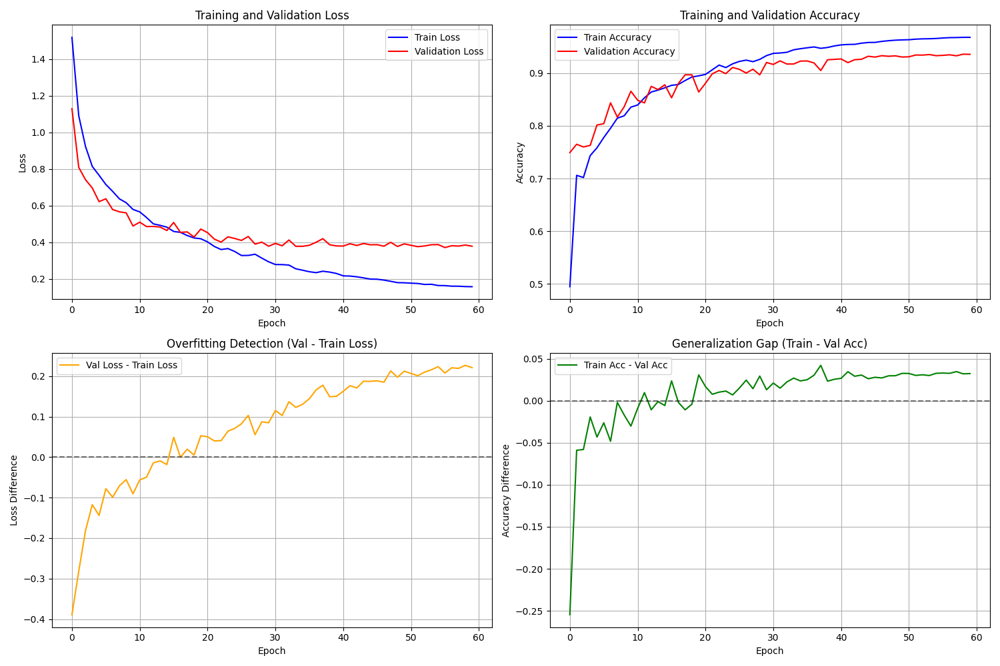</img></br>
</p>

### Where it stands (S3DIS Area 5)

Accuracy alone does not decide whether a model is usable on your own data with one GPU. Four practical criteria matter as much: **Install** (pip wheels vs compiled C++/CUDA extensions), **Custom data** (own classes without rewriting dataset code), **Large clouds** (a documented path from a 100M+ point raw scan to training/inference), and **One GPU** (trains on a single 24 GB card).

**This model** — the reference row every trade-off below is measured against:

| Model | mIoU | mAcc | Install | Custom data | Large clouds | One GPU |
|---|---|---|---|---|---|---|
| **PointEdgeSegNet v2 (2026)** | **64.8** | **72.6** | ✓ pip only | ✓ JSON config + `convert_dataset.py` | ✓ chunking, voting, LAS output | ✓ ~12-20 GB train / ~4 GB inference |

**More accurate, but you pay for it** — every mIoU point above is bought with compiled extensions, heavier preprocessing, bigger models, or multi-GPU recipes:

| Model | mIoU | Install | Custom data | Large clouds | One GPU | Cost of the extra accuracy |
|---|---|---|---|---|---|---|
| Point Transformer V3 (2024) | 73.4 | ✗ spconv + flash-attn + pointops | ✗ Pointcept dataset class | △ no raw-cloud guide | △ needs tuning | heaviest dependency stack; official recipe is multi-GPU |
| PointNeXt-XL (2022) | 70.5 | ✗ CUDA ops (openpoints) | △ S3DIS-centric | ✗ | ✗ A100-class recipe | ~41M params; score depends on heavy training recipe |
| KPConv (2019) | 67.1 | ✗ C++ wrappers | △ code-level work | △ heavy preprocessing | ✓ | ~15M params (5x this model); reprojection step for full-density output |

**Simpler era, lower accuracy** — what this model replaces:

| Model | mIoU | Why not |
|---|---|---|
| RandLA-Net (2020) | ~62.5\* | random sampling drops thin objects; official code TF1.x |
| SPG (2018) | 58.0 | unmaintained since ~2019; partition errors propagate |
| PointNet++ (2017) | ~53.5\* | dated accuracy; slow FPS/ball-query on large clouds |
| DGCNN (2018) | ~48\* | kNN memory forces small blocks; no large-cloud pipeline |

\* Commonly reproduced figures; not reported for Area 5 in the original papers.

PointEdgeSegNet v2 is the only entry with a check in every practicality column. The remaining gap to the top rows (~2.3 mIoU vs KPConv, ~8.6 vs PTv3) is an operator/compute trade, not a VRAM-fit problem — every method above also chunks, samples, or voxelizes large scenes.

## Installation

### Prerequisites

- Python 3.8 or higher
- NVIDIA GPU with CUDA support (recommended)
- Minimum 8GB GPU memory

Download source code and install it like below.
```bash
git clone https://github.com/mac999/point_edge_seg_net
cd point_edge_seg_net
```
If you have CUDA 11.8 version, install packages using requirements.txt
```bash
pip install -r requirements.txt
```

If you have the lastest CUDA version, install them like below. 

### Step 1: Install PyTorch and PyTorch Geometric

Install PyTorch with CUDA support first (replace with your CUDA version):

```bash
pip install torch torchvision torchaudio --index-url https://download.pytorch.org/whl/cu118
```

Install PyTorch Geometric dependencies:

```bash
pip install torch_geometric torch_scatter torch_sparse torch_cluster torch_spline_conv
```

### Step 2: Install Other Dependencies

```bash
pip install numpy scikit-learn open3d tqdm matplotlib
```

## Quick Start: End-to-End Workflow

The pipeline runs in three ordered steps. Each step's output feeds the next; all three read the same `model_params.json`, so features/classes stay consistent across the whole pipeline.

**Step 1 — Convert the raw dataset to processed `.pt` rooms** (`data_preparation.py`)

Reads raw S3DIS annotation files, computes the base per-point features (normals + curvature + RGB + spatial, 10D by default) once per room, and writes one `Data(pos, x, y)` file per room to `processed_s3dis/<Area>/<room>.pt`.

```bash
python data_preparation.py --config model_params.json --s3dis_path ./s3dis_v1.2_aligned --save_path ./processed_s3dis
```

**Step 2 — Train** (`train_model.py`)

On first run this automatically splits the processed rooms into training blocks (column mode: full-height 2 m columns with a leakage-controlled spatial train/val tag; the curvature channel is refreshed at block-build time), then trains and finally evaluates on the held-out test area (Area 5), reporting OA / mAcc / mIoU and writing everything to `logs/<timestamp>/`.

Two training variants:

```bash
# (a) plain baseline - 10D features, reproduces the confirmed v1.1 run (blocks in block_s3dis/)
python train_model.py --config model_params.json --block_mode column --column_window 2.0 --column_stride 2.0 --num_epochs 60 --batch_size 10

# (b) GLOBAL context - same as (a) plus --block_context: appends a wide-area neighbourhood
#     descriptor (verticality/horizontality/curvature/density + z-histogram over a 4 m buffer)
#     to every block -> 10D base + 12D context = 22D input (blocks cached in block_s3dis_ctx/)
python train_model.py --config model_params.json --block_mode column --column_window 2.0 --column_stride 2.0 --num_epochs 60 --batch_size 10 --block_context
```

On Windows, **`run_train_global.bat`** runs variant (b) — activate your conda/python environment first, then run it from the repo root. No re-run of `data_preparation.py` is needed to switch variants: the context descriptor is computed at block-build time from the same `.pt` files, and the two block caches (`block_s3dis/` vs `block_s3dis_ctx/`) stay separate so A/B runs never mix. To force block regeneration (e.g. after changing block/feature settings), delete the corresponding block cache first.

**Step 3 — Inference on a new point cloud** (`inference.py`)

Splits the input into coverage-guaranteed column blocks, votes per point, and writes a colored `_segmented.las` (plus `.txt`) next to the input.

```bash
# plain (10D, e.g. confirmed v1.1) model:
python inference.py                       # confirmed model + sample cloud
python inference.py -i ./my_scan.txt      # your own X Y Z [R G B] cloud
python inference.py --tta                 # extra accuracy via rotation voting

# --block_context-trained (22D) model:
python inference.py --block_context -m logs/<timestamp>/best_model.pth -i ./my_scan.txt
```

On Windows, **`run_infer_global.bat <model.pth> [input.txt]`** wraps the context (22D) inference — pair it with models produced by `run_train_global.bat`.

> The inference feature settings must match how the model was trained (same config / `--block_context` state); a mismatch fails fast with a dimension error.

## Dataset Preparation

### Using Custom Point Cloud Datasets

**PointEdgeSegNet now supports custom point cloud datasets!** You can train and infer on any point cloud dataset by configuring the `model_params.json` file with your own class names, colors, and parameters.

#### Configuration File: model_params.json

Create or modify `model_params.json` to define your dataset configuration:

```json
{
  "dataset_name": "Your_Dataset_Name",
  "num_classes": 8,
  "class_names": ["class1", "class2", "class3", ...],
  "class_colors": [[R, G, B], [R, G, B], ...],
  "class_weights": [1.0, 0.8, 0.9, ...],
  "num_features": 10,
  "block_size": 8192,
  "preprocessing": {
    "grid_min_coords": [0.0, 0.0, 0.0],
    "grid_resolution": 1.0
  },
  "description": "Description of your dataset"
}
```

**Configuration Parameters:**

| Parameter | Type | Description | Example |
|-----------|------|-------------|---------|
| `dataset_name` | string | Name of your dataset | "Custom_Outdoor_Scene" |
| `num_classes` | int | Number of semantic classes | 8 |
| `class_names` | array | List of class names | ["ground", "building", "tree", ...] |
| `class_colors` | array | RGB colors for visualization (0-255) | [[139, 69, 19], [255, 0, 0], ...] |
| `class_weights` | array | Loss weights for class balancing | [1.0, 0.8, 0.9, ...] |
| `num_features` | int | Feature dimension (default: 10) | 10 |
| `block_size` | int | Points per block (default: 8192) | 8192 |
| `preprocessing.grid_min_coords` | array | Minimum coordinates for grid normalization | [0.0, 0.0, 0.0] |
| `preprocessing.grid_resolution` | float | Grid resolution for spatial hashing | 1.0 |

**Example Configurations:**

1. **Indoor Scene (S3DIS-like)**: `model_params.json`
   - 13 classes: ceiling, floor, wall, furniture, etc.
   - Fine grid resolution (0.5) for detailed indoor spaces
   - Negative min_coords for normalized coordinate handling

2. **Outdoor Scene**: `model_params_example_outdoor.json`
   - 8 classes: ground, building, tree, vehicle, etc.
   - Coarser grid resolution (2.0) for large outdoor spaces
   - Zero-origin min_coords for outdoor coordinates

#### Training with Custom Configuration

```bash
# Train with your custom configuration
python train_model.py --config model_params_custom.json

# Train with outdoor example
python train_model.py --config model_params_example_outdoor.json \
    --processed_data_path ./processed_outdoor \
    --block_data_path ./block_outdoor
```

#### Inference with Custom Configuration

```bash
# Inference with custom model
python inference.py --config model_params_custom.json \
    --model_weights ./logs/custom_model/best_model.pth \
    --input_cloud ./data/custom_scene.txt
```

### Public Datasets for Infrastructure & Urban Point Clouds

Below is a curated list of **publicly available, labeled point cloud datasets** for outdoor / infrastructure domains (bridge, tunnel, railway, earthwork/utilities, urban and aerial scenes). Because PointEdgeSegNet reads a configurable input format (`input` / `features` blocks in `model_params.json`: enable/disable RGB, set `spatial_scale`, map input columns), these datasets can be adapted for training after converting them to the `X Y Z [R G B ...]` text/array format the preprocessor expects. Most are distributed as **LAS/PLY**, so a one-time conversion (e.g. with `laspy`, `open3d`, or `PDAL`) is usually required, and `spatial_scale` should be tuned to each domain's point spacing (indoor ≈ 0.1 m, bridge/tunnel ≈ 0.3–1 m, aerial/terrain ≈ 1–10 m).

> Always check each dataset's own **license / terms of use** before training or redistribution. Several require a short data-request form.

| Domain | Dataset | Description (sensor · scale · classes) | Format | Access / Download |
|--------|---------|----------------------------------------|--------|-------------------|
| **Bridge** | SemanticBridge | TLS + MLS scans of **20 bridges** (UK & Germany), ~245M points, **9 classes** (abutment, superstructure, deck, pillar, railing, vegetation, ground, sign, unlabeled); includes sensor domain-gap analysis | PLY/LAS | [GitHub](https://github.com/mvg-inatech/3d_bridge_segmentation) · [paper](https://arxiv.org/abs/2512.15369) |
| **Bridge** | BrPCD (Bridge Point Cloud Databank) | Multi-type bridge databank, **98 bridges** (10 real-scanned + 88 augmented/virtual), 2,827 labeled components; suspension / cable-stayed / girder types | PCD | [paper (Google Drive link inside)](https://onlinelibrary.wiley.com/doi/10.1111/mice.13384) |
| **Tunnel** | STSD (Subway Tunnel Seg. Dataset) | rMMS mobile LiDAR, **>2.26B points** over 2,700 m, **12 classes**, 3 tunnel shapes; point clouds + projected images | LAS (+images) | [GitHub](https://github.com/lichking2017/STSD) (data-request form; GPL-3.0) |
| **Tunnel** | Seg2Tunnel | Segmental tunnel-lining point clouds from **5 tunnels / 1,300 rings**, hierarchical (ring / block / component) annotations | LAS/PLY | [paper](https://www.sciencedirect.com/science/article/abs/pii/S0886779824001536) (data on request) |
| **Railway** | WHU-Railway3D | Mobile LiDAR, **~4.6B points** over ~30 km (urban/rural/plateau), **11 classes** (rails, masts, overhead lines, fences, …); includes intensity, scan angle, returns | PLY + `.npy` labels | [GitHub](https://github.com/WHU-USI3DV/WHU-Railway3D) (data-request form) |
| **Earthwork / Utilities** | OpenTrench3D | Open-trench underground-utility scans, **310 clouds / 528M points**, **5 classes** (utilities, surroundings, …); first public trench dataset (CVPRW 2024) | PLY | [GitHub](https://github.com/SimonBuusJensen/OpenTrench3D) |
| **Urban (MLS)** | Toronto-3D | Mobile LiDAR of ~1 km urban roadway, **78.3M points**, **8 classes** (road, marking, natural, building, utility line, pole, car, fence); XYZ+RGB+intensity | LAS/PLY | [GitHub](https://github.com/WeikaiTan/Toronto-3D) (CC BY-NC 4.0) |
| **Urban (UAV)** | SensatUrban | UAV photogrammetry of UK cities, **~3B points** over ~6 km², **13 classes** | PLY | [GitHub](https://github.com/QingyongHu/SensatUrban) (form; MIT code) |
| **Aerial (ALS)** | DALES | Airborne LiDAR, **>0.5B points** over 10 km² (40 scenes), **8 classes** (ground, vegetation, cars, trucks, poles, power lines, fences, buildings) | multiple (PLY/LAS/…) | [Project page](https://sites.google.com/a/udayton.edu/vasari1/research/earth-vision/dales) · [paper](https://arxiv.org/abs/2004.11985) |
| **Aerial (photogrammetry)** | STPLS3D | Real + synthetic aerial photogrammetry, **>17 km²**, up to **18 classes**, 0.1 m spacing; includes terrain/ground | PLY | [Website](https://www.stpls3d.com/data) · [GitHub](https://github.com/meidachen/STPLS3D) |

Notes:
- **Indoor reference:** the default configuration targets **S3DIS** (indoor), described below.
- **Roads / driving** (not infrastructure-specific but widely used): [SemanticKITTI](http://semantic-kitti.org/), [Paris-Lille-3D](https://npm3d.fr/paris-lille-3d), and [nuScenes-lidarseg](https://www.nuscenes.org/nuscenes) provide additional large-scale urban/road point clouds.
- After conversion, set the appropriate `num_classes`, `class_names`, `class_colors`, `input.rgb_cols` (or `use_rgb: false` for colorless LiDAR), and `features.spatial_scale` in `model_params.json` (see [model_params_example_terrain.json](model_params_example_terrain.json) for a colorless, large-scale example).

#### Converting a dataset to this repo's format

Use [convert_dataset.py](convert_dataset.py) to turn a downloaded dataset into the processed `.pt` format the training pipeline consumes (same `Data(pos, x, y)` objects as the S3DIS preprocessor). It reads **PLY / LAS / TXT / paired-NPY**, remaps each dataset's class ids, extracts the configured features, writes `processed_<name>/train|test/<scene>.pt`, and can emit a ready-to-use `model_params_<name>.json`.

Built-in profiles (override any field from the CLI): `toronto3d`, `sensaturban`, `dales`, `stpls3d`, `opentrench3d`, `whu_railway3d`, `semanticbridge`.

```bash
# 0) install optional readers for the format you downloaded
pip install plyfile        # .ply    (Toronto-3D, SensatUrban, OpenTrench3D, STPLS3D, DALES-ply)
pip install laspy          # .las/.laz (DALES-las, some bridge/tunnel exports)

# 1) inspect first (no files written): checks parsing, point counts, labeled ratio
python convert_dataset.py --dataset opentrench3d --input_dir ./raw/OpenTrench3D --dry_run

# 2) convert + emit a matching config
python convert_dataset.py --dataset opentrench3d --input_dir ./raw/OpenTrench3D \
    --output_dir ./processed_opentrench3d --emit_config

# 3) train with the generated config
python train_model.py --config model_params_opentrench3d.json \
    --processed_data_path ./processed_opentrench3d --train_areas train --test_area test \
    --block_mode column --no_wandb --cooldown_sec 0

# Colorless aerial LiDAR that ships pre-split into train/ and test/ folders (e.g. DALES):
python convert_dataset.py --dataset dales --input_dir ./raw/DALES/train --split train --no_rgb --emit_config
python convert_dataset.py --dataset dales --input_dir ./raw/DALES/test  --split test  --no_rgb
```

Notes on the converter:
- `.ply`/`.las` field names differ between download versions — override with `--label_field`, force color with `--rgb`/`--no_rgb`, and tune the analysis scale with `--spatial_scale`.
- Large-coordinate clouds (UTM, e.g. Toronto-3D) are auto-translated to a local origin to avoid float32 precision loss (disable with `--no_recenter`).
- Very large scenes (hundreds of millions of points) should be tiled before conversion, since normal/curvature/spatial features are computed per file.

### Stanford 3D Indoor Spaces Dataset (S3DIS)

1. Download the S3DIS dataset from [Stanford Vision Lab](https://cvgl.stanford.edu/resources.html) and [point cloud storage](https://sdss.redivis.com/datasets/9q3m-9w5pa1a2h/files)
2. Extract the dataset to `./s3dis_v1.2_aligned/` directory
3. Run data preprocessing with input_path, output_path arguments:

```bash
# S3DIS preprocessing with default configuration
python data_preparation.py --config model_params.json

# Custom data preparation with specific areas
python data_preparation.py --config model_params.json \
    --s3dis_path ./s3dis_v1.2_aligned \
    --save_path ./processed_s3dis \
    --areas Area_1 Area_2 Area_3
```

The preprocessing script will:
- Convert raw point cloud data to PyTorch Geometric format. You can download [the converted point cloud and PLY files](https://drive.google.com/drive/folders/1QdISVNKUnVrUVxugQrmezWmNuL78ZXoq)
- Calculate geometric features (normals, curvature)
- Split data into 8192-point blocks for efficient training
- Save processed data to `./processed_s3dis/`

### Supported Classes

#### S3DIS Dataset (Default Configuration)

The default model supports 13 semantic classes for indoor scene segmentation:

| Class ID | Class Name | RGB Color | Color Name | Hex Code |
|----------|------------|-----------|------------|----------|
| 0 | ceiling | (233, 229, 107) | Light Yellow | #E9E56B |
| 1 | floor | (95, 156, 196) | Light Blue | #5F9CC4 |
| 2 | wall | (179, 116, 81) | Brown | #B37451 |
| 3 | beam | (241, 149, 131) | Light Coral | #F19583 |
| 4 | column | (81, 163, 163) | Teal | #51A3A3 |
| 5 | window | (223, 160, 168) | Light Pink | #DFA0A8 |
| 6 | door | (142, 86, 114) | Dark Pink | #8E5672 |
| 7 | table | (153, 223, 138) | Light Green | #99DF8A |
| 8 | chair | (149, 149, 241) | Light Purple | #9595F1 |
| 9 | sofa | (107, 229, 233) | Cyan | #6BE5E9 |
| 10 | bookcase | (233, 107, 229) | Magenta | #E96BE5 |
| 11 | board | (107, 233, 107) | Bright Green | #6BE96B |
| 12 | clutter | (160, 160, 160) | Gray | #A0A0A0 |

**Color Scheme Design:**
- **Structural elements** (ceiling, floor, wall): Natural tones (yellow, blue, brown)
- **Architectural features** (beam, column, window, door): Warm and cool contrasts
- **Furniture** (table, chair, sofa, bookcase): Vibrant colors for easy identification
- **Functional items** (board): Bright green for visibility
- **Miscellaneous** (clutter): Neutral gray

#### Custom Dataset Classes

You can define your own classes in `model_params.json`. For example, an outdoor scene configuration:

| Class ID | Class Name | RGB Color | Description |
|----------|------------|-----------|-------------|
| 0 | ground | (139, 69, 19) | Ground surface |
| 1 | building | (255, 0, 0) | Building structures |
| 2 | tree | (0, 255, 0) | Trees and vegetation |
| 3 | vehicle | (0, 0, 255) | Cars, trucks, etc. |
| 4 | road | (128, 128, 128) | Road surfaces |
| 5 | vegetation | (34, 139, 34) | Low vegetation |
| 6 | pedestrian | (255, 255, 0) | People |
| 7 | others | (128, 0, 128) | Miscellaneous objects |

**Tips for Defining Custom Classes:**
1. Choose distinct RGB colors for easy visual discrimination
2. Set `class_weights` based on class frequency (higher weights for rare classes)
3. Adjust `grid_resolution` based on scene scale (smaller for indoor, larger for outdoor)
4. Set `grid_min_coords` to normalize your coordinate system

### S3DIS dataset Characteristics

The S3DIS dataset is not uniform. Each of the 6 areas, sourced from 3 different buildings, has a unique size, layout, and purpose. This leads to significant variations in point cloud size and class distribution. A precise statistical breakdown per area is not officially provided and requires manual data analysis.

| Area | Building Source | Primary Room Types | Expected Characteristics |
| :--- | :--- | :--- | :--- |
| **Area 1** | Building 1 | Offices, conference rooms, hallways | High density of furniture (`table`, `chair`, `bookcase`). |
| **Area 2** | Building 2 | Lounge, hallways, offices | Similar to Area 1, but with a potentially higher proportion of `sofa`. |
| **Area 3** | Building 1 | Open spaces, hallways, restrooms | Dominated by structural elements (`wall`, `floor`, `ceiling`); sparse furniture. |
| **Area 4** | Building 2 | Offices, hallways, storage areas | Similar characteristics to other office-centric areas. |
| **Area 5** | Building 3 | Auditorium, lobby, offices, hallways | The most diverse area; likely the largest point cloud. In example, high chair count due to the auditorium. Frequently used as a test set. |
| **Area 6** | Building 1 | Hallways, offices, pantry | Office-centric distribution, similar to Area 1. |

#### Pros

* **Realistic Diversity**: The variation mimics real-world scenarios where models must adapt to different environments.
* **Robustness Testing**: The distinct nature of each area provides an excellent framework for testing a model's generalization capabilities.

#### Cons

* **Data Imbalance**: The dataset has a significant class imbalance not only overall but also within and between areas.
* **Evaluation Bias**: Testing on a single area (e.g., Area 5) can lead to a misleading evaluation of a model's performance, as it may be over-fitted to the specific objects and layouts of the training areas.

To ensure a robust evaluation, consider the following:

* **Use 6-Fold Cross-Validation**: The standard evaluation protocol for S3DIS is **6-fold cross-validation**. You train on 5 areas and test on the remaining one, repeating this process for all 6 areas. This ensures the model is evaluated against all environmental types.

* **Be Aware of Bias**: A model's performance on a specific hold-out area is heavily influenced by the composition of the training areas. For instance, if you test on Area 5, but none of the training areas had a similar space like an auditorium, the performance on certain classes might suffer.

* **Consider Data Augmentation**: Employ data augmentation strategies that account for the dataset's diversity. This can help the model generalize better by creating more balanced exposure to different types of environments and objects.

## Model Architecture

### PointEdgeSegNet Theory

PointEdgeSegNet is built on two key concepts:

#### 1. EdgeConv Layers

EdgeConv (Edge Convolution) is designed specifically for point cloud processing:

- Constructs dynamic k-nearest neighbor graphs for each point
- Captures local geometric relationships through edge features
- Combines point features with relative position information
- Maintains permutation invariance while being sensitive to local structure

Mathematical formulation:
```
edge_feature = MLP([x_i, x_j - x_i])
output_i = max(edge_feature) for all j in neighbors(i)
```

#### 2. U-Net Architecture

The encoder-decoder structure with skip connections:

**Encoder Path:**
- Stage 1: Input features -> 64 channels
- Stage 2: 64 -> 128 channels (4x downsampling)
- Stage 3: 128 -> 256 channels (4x downsampling)  
- Stage 4: 256 -> 512 channels (4x downsampling)

**Decoder Path:**
- Upsampling with k-NN interpolation
- Skip connections preserve fine-grained details
- Progressive feature fusion at each scale

### Network Flow

1. **Input Processing**: Raw point coordinates + geometric features + RGB + spatial (10D: normals 3 + curvature 1 + RGB 3 + spatial 3), with per-block coordinate centering
2. **Hierarchical Encoding**: Multi-scale feature extraction with progressive downsampling
3. **Bottleneck**: Highest-level feature representation
4. **Hierarchical Decoding**: Feature upsampling with skip connections
5. **Classification Head**: Point-wise classification to 13 semantic classes

### Key Innovations

- **Dynamic Graph Construction**: Adapts to local point density variations
- **Multi-scale Feature Fusion**: Combines global context with local details
- **Geometric Feature Integration**: Leverages Open3D for robust normal/curvature computation
- **Memory Efficient Processing**: Block-based training and inference

## Train model and Inference 
### Training

Basic training with default settings:

```bash
# Train with default configuration
python train_model.py

# Train with custom parameters
python train_model.py --num_epochs 50 --batch_size 8 --learning_rate 0.0005

# Train with specific areas and paths
python train_model.py --train_areas Area_1 Area_2 Area_3 --test_area Area_4 --num_epochs 25

# Full custom training example
python train_model.py \
    --processed_data_path ./custom_processed \
    --block_data_path ./custom_blocks \
    --train_areas Area_1 Area_2 Area_3 Area_4 Area_6 \
    --test_area Area_5 \
    --num_epochs 30 \
    --batch_size 4 \
    --learning_rate 0.001 \
    --block_size 8192
```

### Inference

Basic inference with default model:

```bash
# Basic inference (uses default model and test file)
python inference.py

# Inference with custom model and input
python inference.py --model_weights ./logs/20251004_221236/best_model.pth --input_cloud ./sample/area_6_conferenceRoom_1.txt

# Inference without visualization (for batch processing)
python inference.py --no_visualization

# Full custom inference example  
python inference.py \
    --model_weights ./custom_logs/best_model.pth \
    --input_cloud ./data/large_scene.txt \
    --block_path ./block_s3dis \
    --no_vis
```

### Common Run Scenarios

**Scenario 1: Quick Test Run**
```bash
# Minimal training for testing (5 epochs)
python train_model.py --num_epochs 5 --batch_size 2

# Quick inference test
python inference.py --no_visualization
```

**Scenario 2: Production Training**
```bash
# Full training with optimal settings
python train_model.py --num_epochs 50 --batch_size 8 --learning_rate 0.0005
```

**Scenario 3: Batch Processing**
```bash
# Process multiple files without visualization
for file in ./test_scenes/*.txt; do
    python inference.py --input_cloud "$file" --no_vis
done
```

**Scenario 4: Memory-Constrained Training**
```bash
# Reduce memory usage with smaller batch size and block size
python train_model.py --batch_size 2 --block_size 4096
```

### Available Arguments

**train_model.py arguments:**
- `--processed_data_path`: Path to processed data directory
- `--block_data_path`: Path to block data storage
- `--train_areas`: Training areas (space-separated list)
- `--test_area`: Test area name
- `--num_epochs`: Number of training epochs
- `--batch_size`: Batch size for training
- `--learning_rate`: Learning rate for optimizer
- `--num_features`: Number of input features (default: 10)
- `--block_mode`: `column` (default, context-preserving) or `grid` (legacy)
- `--block_context`: append the wide-area per-block context descriptor (22D input; blocks cached in `block_s3dis_ctx`), with `--context_buffer` (m) and `--context_bins` to tune it
- `--num_classes`: Number of output classes (default: 13)
- `--block_size`: Size of point cloud blocks (default: 8192)
- `--block_context` / `--no_block_context`: enable/disable the buffered block-context descriptor (overrides `features.use_block_context`)
- `--context_buffer`: block-context buffer distance in metres (default 2.0)
- `--context_bins`: block-context Z-histogram bins (default 4)

**inference.py arguments:**
- `-m, --model_weights`: Path to trained model weights (.pth)
- `-i, --input_cloud`: Path to input point cloud file (.txt)
- `-b, --block_path`: Directory for temporary inference blocks
- `--no_visualization, --no_vis`: Skip 3D visualization
- `--voting` / `--no_voting`: coverage-guaranteed column voting (default on) vs legacy sequential chunks
- `--tta`: test-time augmentation (Z-rotations 90/180/270 voted together)
- `--ensemble WEIGHTS.pth [...]`: extra model weights to softmax-average with the primary model
- `--column_window`, `--column_stride`: column size / step (m); output is always a colored `_segmented.las` + `_segmented.txt`
- `--block_context` / `--no_block_context`: must match how the model was trained (22D context models need `--block_context`; see `run_infer_global.bat`)
- `--block_context` / `--no_block_context`, `--context_buffer`, `--context_bins`: block-context descriptor — must match how the model was trained

## Training

### Quick Start

```bash
python train_model.py
```

### Configuration

Edit the configuration section in `train_model.py`:

```python
TRAIN_AREAS = ['Area_1', 'Area_2', 'Area_3', 'Area_4', 'Area_6']
TEST_AREA = 'Area_5'
NUM_EPOCHS = 30
BATCH_SIZE = 4
LEARNING_RATE = 0.001
BLOCK_SIZE = 8192
```

### Training Features

- Automatic train/validation split
- Learning rate scheduling with warmup
- Gradient clipping for stability
- Comprehensive logging (CSV + JSON)
- Model checkpointing (best and latest)
- Real-time loss visualization

### Output Structure

```
logs_YYYYMMDD_HHMMSS/
├── training_log.csv
├── config.json
├── best_model.pth
├── latest_model.pth
└── loss_curves.png
```

## Inference

### Basic Usage

```bash
python inference.py
```

### Inference Process

1. **Block Creation**: Splits input point cloud into 8192-point blocks (you can customize it)
2. **Feature Calculation**: Computes geometric features using Open3D
3. **Model Inference**: Processes each block through trained model
4. **Result Merging**: Combines predictions from all blocks
5. **Visualization**: Displays results with Open3D viewer

### Configuration

Edit the paths in `inference.py`:

```python
MODEL_WEIGHTS_PATH = './logs_YYYYMMDD_HHMMSS/best_model.pth'
TEST_POINT_CLOUD_PATH = './s3dis_v1.2_aligned/Area_1/conferenceRoom_1/conferenceRoom_1.txt'
```

## File Structure

```
point_unet/
├── model.py              # PointEdgeSegNet architecture
├── train_model.py        # Training script
├── inference.py          # Inference script
├── data_preparation.py   # Data preprocessing
├── requirements.txt      # Dependencies
├── README.md            # This file
├── s3dis_v1.2_aligned/  # Raw S3DIS dataset
├── processed_s3dis/     # Processed data
├── block_s3dis/         # Training blocks
├── inference_blocks/    # Inference blocks
└── logs_*/              # Training logs and models
```

## Performance

### Training Performance

- Training Time: ~3 hours for 60 epochs on a single 24GB GPU
- GPU Memory (measured, v1.1 run): avg ~17.2 GB / peak ~18.7 GB whole-GPU on a 24 GB card (wandb system metrics; BATCH_SIZE=10, EdgeConv k=32, effective batch 60 via gradient accumulation)
- Scales to arbitrarily large training sets — memory is per block, not per scene

### Inference Performance

- Coverage-guaranteed column voting: every point of a large/dense cloud is predicted (no drop-to-`ceiling`)
- Optional TTA and model ensembling for extra accuracy at no extra VRAM
- Memory Efficiency: processes 100M-point clouds block by block; outputs colored LAS + TXT

## Troubleshooting

### Common Issues

1. **CUDA Out of Memory**: Reduce BATCH_SIZE in training configuration
2. **Missing Dependencies**: Install PyTorch Geometric following official instructions
3. **Data Loading Errors**: Ensure S3DIS dataset structure matches expected format

### GPU Memory Optimization

- Use smaller batch sizes (BATCH_SIZE = 2-4)
- Enable mixed precision training
- Clear GPU cache between experiments

## Insight
When training point cloud data, it's crucial to assume all data characteristics. Inputs that deviate from these assumptions will not yield good results (e.g., indoor vs. outdoor, bright vs. dark lighting, and variations in label object types and features). In Example of S3DIS dataset, The Area 1 (Train) and Area 5 (Test) datasets are representative examples. Because these two datasets exhibit such high variation, standard training alone won't significantly improve Test Acc. This consideration must be taken into account when designing the model to determine which data features to train. Statistical analysis must be performed first to ensure inductive inference, a golden rule in deep learning model training. When I tried to improve the performance (accuray, loss) of test dataset (unseen), I used some solutions like the argumented dataset with features, model size increasement within 24G VRAM etc, but the performance was limited. Local features acceptance is always an issue in tranining model becuase it's difficult to increase the model size and architecture in usecase under the small VRAM.

Update (v1.0): several of these limits were pushed back without any hardware upgrade — context-preserving column blocks, per-block coordinate centering (translation invariance), an mIoU-aware Lovász+Focal loss, a corrected surface-variation curvature feature, and a fixed coverage-guaranteed voting pipeline together raised held-out Area 5 from ~mIoU 49 to **59.6** (OA 86.2%); fixing a silent AMP GradScaler bug and retraining (v1.1) pushed this to **mIoU 60.0** (OA 86.6%). The remaining bottleneck is long-range context between blocks and the two rarest classes (`column`, `sofa`); closing the gap to sparse-conv/transformer methods (65–70+) is an *architecture* problem (a different convolution/attention operator), not a VRAM one — all such methods still chunk or down-voxelize large clouds rather than fitting them whole.

## Contributing

Contributions are welcome! Please feel free to submit pull requests or open issues for bugs and feature requests.

## Author

- **Name**: Taewook Kang
- **Email**: laputa9999@gmail.com

## License

This project is released under the MIT License. See LICENSE file for details.

## Acknowledgments

- Stanford Vision Lab for the S3DIS dataset
- PyTorch Geometric team for the excellent graph neural network library
- Open3D team for 3D geometry processing tools


