## Overview

PointEdgeSegNet is the lightweight 3D point cloud segmentation model based on EdgeConv, Transforer and U-Net architecture. This project has purpose of researching and developing 3D point cloud segmenation model in [3D Scan to BIM pipeline](https://github.com/mac999/scan_to_bim_pipeline), [3D scan to Model](https://github.com/mac999/scan_to_model_pipeline) development that can classify each point in large-scale 3D PCD into semantic categories such as ceiling, floor, wall, furniture, and other industry objects which you can customize easily while keeping the memory footprint modest (measured ~12-20 GB during training and ~4 GB at inference with the current recipe). This is a personal project that I develop in my spare time, but if you're interested, you're welcome to join me in developing it at any time.

Although many research and open-source models exist for PCD segmentation, they have been challenging to use in practice. For example, some SOTA models in this research field use lots of GPU with VRAM, so it's difficult to train the models for industry. They have issues under a limited VRAM budget, large dataset processing in specific industry domain etc. When processing large PCD files, open-source models often did not perform as well as claimed in papers or required additional development to handle them. Some model codes were too outdated to be installed and run in current development environments. Some open-source models had overly complex structures and modules, making them difficult to modify for specific purposes. Models that consumed excessive GPU resources were problematic in practice. Some models used specialized libraries or file formats for training, limiting their overall usability. Few similar projects had well-documented learning and training methods. This project strives to address these issues to the best of its ability.

The current backbone (v2, `models/stencil.py`) voxelizes the input once and keeps every stage on a voxel lattice, so spatial neighbourhoods are looked up at fixed lattice offsets instead of searched — kNN-quality local geometry at a fraction of the cost. Local features are aggregated with point-wise MLPs plus relative-position and feature-difference encodings inside a U-Net encoder-decoder, and a lightweight Transformer at the bottleneck preserves global context across scales. The original EdgeConv backbone (v1, `models/edgeconv.py`) is kept as a legacy path. This approach enables accurate semantic segmentation of complex indoor scenes. 

PointEdgeSegNet supports large-scale point cloud training, custom dataset and segmentation inference. Any point cloud format that can be used for training, such as files generated by a matterport or lidar scanner in the <X,Y,Z,R,G,B> format, can be used for training.

### Benefits

- **Measured, modest memory footprint.** With the published v2 recipe, training sits at ~12-20 GB steady and inference at about 4 GB regardless of cloud size; `--batch_size 2` brings training down to roughly 8-10 GB. These are measurements from the runs in `logs/`, not a hardware requirement — smaller budgets have not been benchmarked. Large clouds are handled by chunking rather than by down-voxelizing or hundreds of sliding windows.
- **Scales to arbitrarily large clouds.** Space is split into fixed-size blocks (constant memory per block, linear scaling), so a 100M-point LAS scan is handled like a single room — every point is covered at full density, not coarse-voxelized.
- **Lightweight yet competitive.** ~3.0M parameters (about 1/5 of KPConv) reaching S3DIS Area-5 **OA 87.8% / mIoU 64.8%** — past RandLA-Net and within 0.6 of MinkowskiNet, at a fraction of the compute and with no compiled extensions.
- **Practical & self-contained.** Any `X Y Z [R G B ...]` cloud, custom classes via one JSON, standard deps (PyTorch/PyG/Open3D), and colored **LAS** output for direct viewing (CloudCompare, etc.).
- **Honest evaluation.** Reports OA / mAcc / **mIoU** on a truly held-out area with leakage-controlled spatial train/val splits, plus multi-view voting, TTA and model-ensemble inference.

<p align="center">
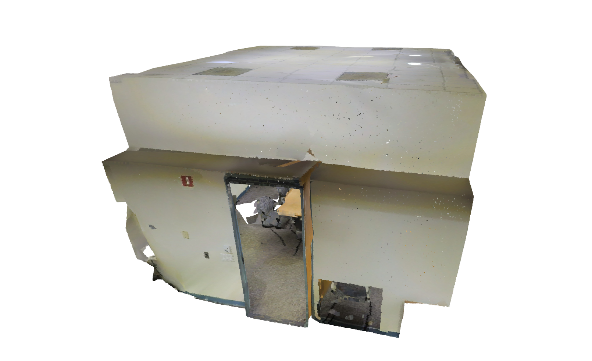</img>
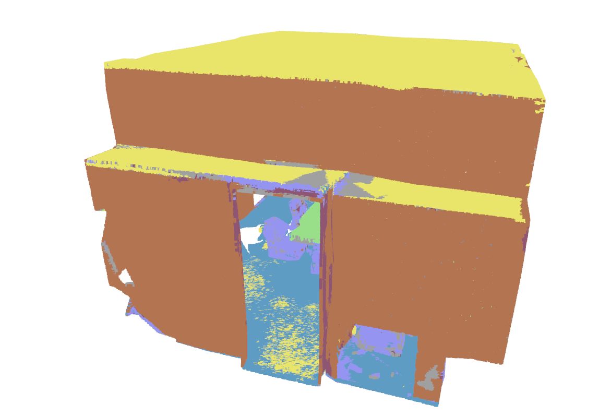</img>
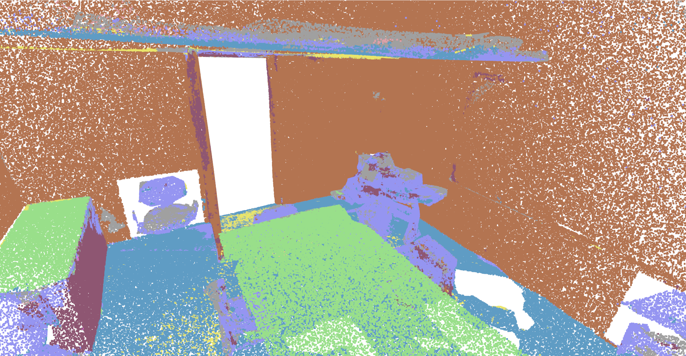</img></br>
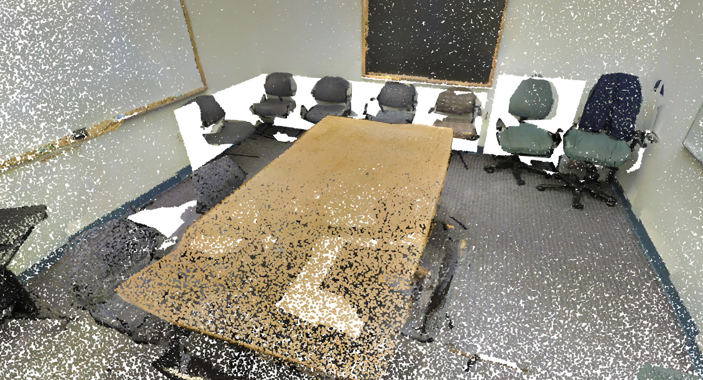</img>
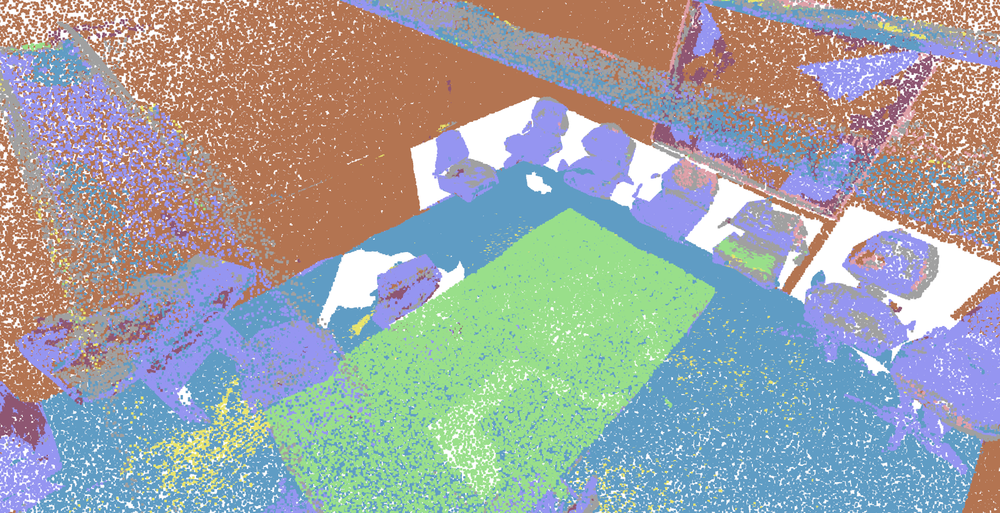</img></br>
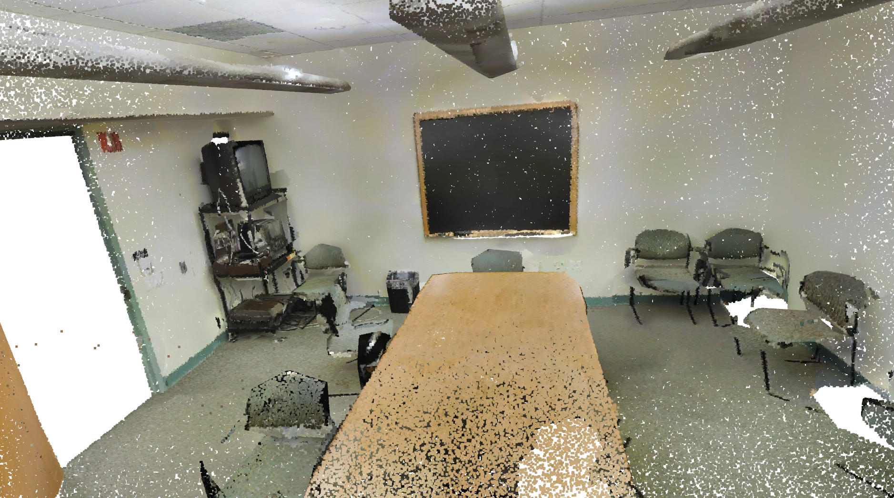</img>
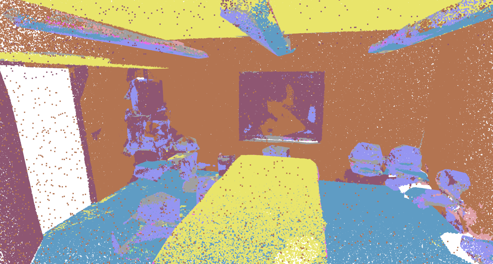</img>
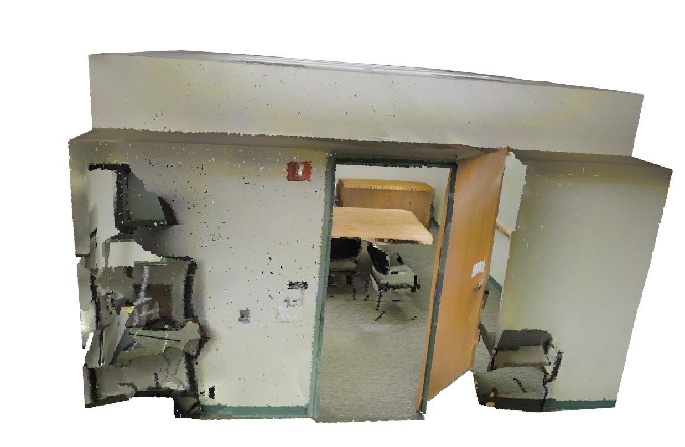</img>
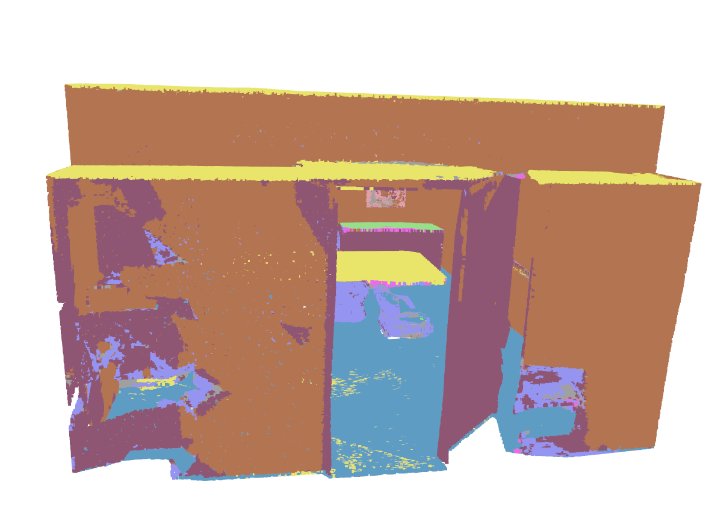</img></br>
</p>
<p align="center">Example. Input point cloud and segments in output results using PointEdgeSegNet model. Latest S3DIS Area 5 (held-out, v2 architecture): OA=87.8%, mAcc=72.6%, mIoU=64.8% with 8-view TTA (64.2 single view).
</p>

## Results at a glance

Two worked examples run on the same code; each has its own page with the full recipe, the
data path and the numbers to check a reproduction against.

| | [Buildings — S3DIS](./building_example.md) | [Bridges — SemanticBridge](./bridge_example.md) |
|---|---|---|
| scene | indoor interiors, 13 classes | outdoor structures, 9 classes |
| held out | Area 5 (78.4 M points) | 5 bridges (84.2 M points) |
| **mIoU** | **64.8** (8-view) / 64.2 single | **69.81** single view |
| OA | 87.8 | 91.6 |
| parameters | 3.07 M | 3.06 M |
| training | ~20 h, one GPU | ~38 h, one GPU |
| released weights | `logs/20260818_003229/` | `weights/bridge_w6_final_model.pth` |

<p align="center">
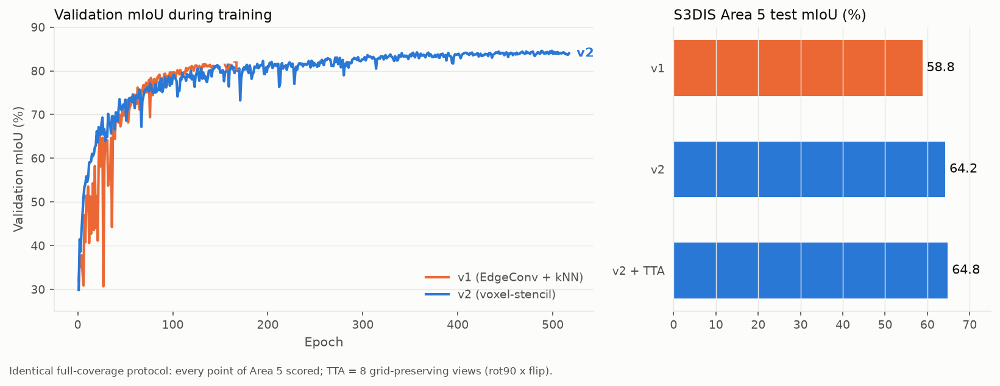<br>
<sub>S3DIS: training curves and Area-5 results, v1 vs v2 under an identical protocol.</sub>
</p>

<p align="center">
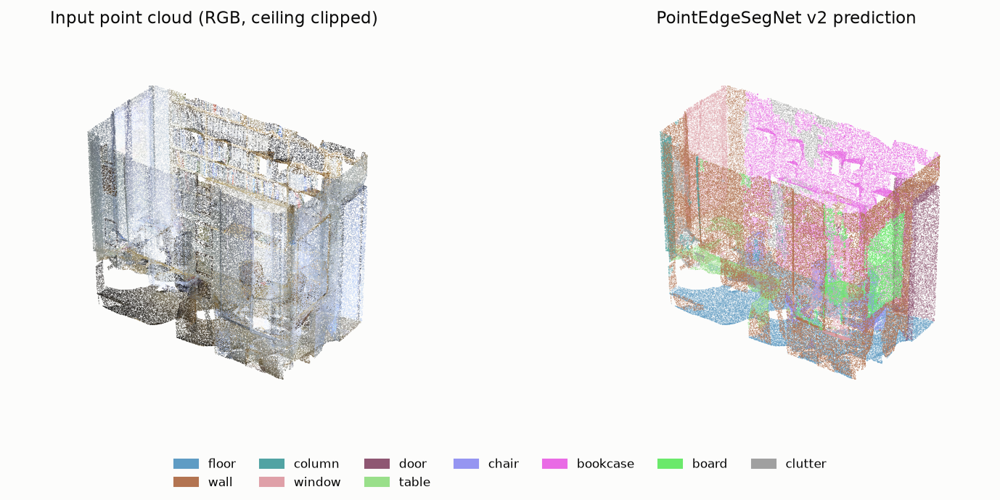<br>
<sub>Inference on a held-out room (Area 5 <code>office_1</code>, 816 K points).</sub>
</p>

<p align="center">
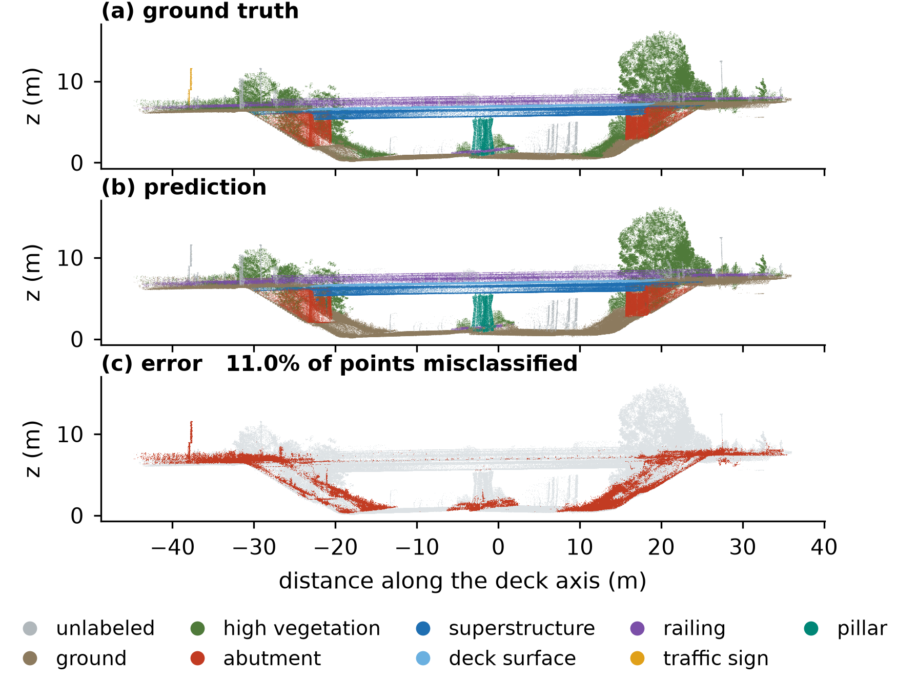<br>
<sub>Inference on a held-out bridge, seen along the deck axis: labels, prediction, and where
the two disagree.</sub>
</p>

## Features

- Large-scale point cloud training and segmentation
- Search-free voxel-stencil aggregation for local geometric relationships (v2); EdgeConv layers kept as the legacy v1 path
- U-Net encoder-decoder architecture with skip connections
- Lightweight Model Architecture with Transformers
- Block-based processing for memory efficiency. Here, the concept of a block refers to a unit of point cloud file that divides a large number of point clouds, such as 100 million, into units that enable model learning and prediction within VRAM.
- Support for S3DIS dataset preprocessing and training
- Inference with 3D visualization of Large-scale point cloud file
- Comprehensive logging and model checkpointing
- Converting 3D model file (IFC) to 3D point cloud file (LAS) to develop train dataset.
- `column` (context-preserving, overlapping full-height) and `grid` block modes, with leakage-controlled spatial train/val split
- Coverage-guaranteed inference with multi-view voting, test-time augmentation (TTA), and model ensembling — safe for large/dense clouds
- OA / mAcc / **mIoU** evaluation (standard S3DIS metric) reported to console and JSON
- Lovász-Softmax + Focal loss and in-model per-block coordinate normalization for accuracy under limited VRAM
- Colored **LAS** export (per-class RGB + `classification` field) for direct viewing in CloudCompare, etc.

## Installation

### Prerequisites

- Python 3.8 or higher
- NVIDIA GPU with CUDA support (recommended)
- GPU memory: ~12-20 GB for training with the published v2 recipe, ~8-10 GB at `--batch_size 2`, ~4 GB for inference

### Step 1: Install PyTorch, PyTorch Geometric and Open3D

These come first and are installed **by hand**, because the correct build depends on your
CUDA version and CPU architecture — which is exactly what a dependency resolver cannot
guess. Replace `cu118` with your CUDA version (`cu128` for Blackwell cards):

```bash
pip install torch torchvision torchaudio --index-url https://download.pytorch.org/whl/cu118
pip install torch_geometric torch_scatter torch_sparse torch_cluster
pip install open3d          # on aarch64 / Python 3.12: open3d-cpu, or conda install -c conda-forge open3d
```

`torch_cluster` is required, not optional: PyG >= 2.8 routes `knn_graph`/`fps` through
`pyg-lib`, and `models/edgeconv.py` falls back to the `torch_cluster` kernels when that is
absent. See `requirements.txt` for the exact versions this project was built and tested
with, including the aarch64 / CUDA 12.8 notes.

### Step 2: Install PointEdgeSegNet

```bash
# straight from GitHub, no clone needed
pip install "git+https://github.com/mac999/point_edge_seg_net.git"

# or from a clone (use -e for development: edits take effect without reinstalling)
git clone https://github.com/mac999/point_edge_seg_net
cd point_edge_seg_net
pip install .
```

Optional extras: `pip install ".[ifc]"` for the IFC converter (`ifcopenshell`), `".[wandb]"`
for experiment tracking, `".[full]"` to let pip pull the deep-learning stack itself
(convenient, but Step 1 is the reliable way).

Installing puts five commands on your PATH — they are the same entry points as the scripts,
so every flag documented in this README applies unchanged:

| Command | Same as | Purpose |
|---|---|---|
| `pesn-prepare` | `python data_preparation.py` | raw dataset -> processed per-room tensors |
| `pesn-train` | `python train_model.py` | train a model |
| `pesn-infer` | `python inference.py` | segment a cloud -> colored LAS + TXT |
| `pesn-eval` | `python evaluate_full.py` | full-coverage scoring of a held-out area |
| `pesn-convert` | `python convert_dataset.py` | convert a custom dataset to the training format |

```bash
pesn-infer -i ./my_scan.txt --config ./model_params_room.json \
    -m ./logs/20260818_003229/final_model.pth \
    --arch v2 --v2_neighbors stencil --v2_stencil 2 --v2_diff --v2_directional \
    --enc_channels 64,192,320,448 --bottleneck_dim 256
```

Model weights and `model_params*.json` are **not** bundled in the wheel — they are inputs you
pass by path. Clone the repo (or download the files) to get the released checkpoints under
`logs/` and the example configs.

Installation is optional: a clone works as-is with `python train_model.py ...` and needs only
Step 1 plus `pip install numpy scikit-learn pandas tqdm matplotlib laspy`.

## Quick Start: End-to-End Workflow

The pipeline runs in three ordered steps. Each step's output feeds the next; all three read the same `model_params.json`, so features/classes stay consistent across the whole pipeline.

**Step 1 — Convert the raw dataset to processed `.pt` rooms** (`data_preparation.py`)

Reads raw S3DIS annotation files, computes the base per-point features (normals + curvature + RGB + spatial, 10D by default) once per room, and writes one `Data(pos, x, y)` file per room to `processed_s3dis/<Area>/<room>.pt`.

```bash
python data_preparation.py --config model_params.json --s3dis_path ./s3dis_v1.2_aligned --save_path ./processed_s3dis
```

**Step 2 — Train** (`train_model.py`)

On first run this automatically splits the processed rooms into training blocks (column mode: full-height 2 m columns with a leakage-controlled spatial train/val tag; the curvature channel is refreshed at block-build time), then trains and finally evaluates on the held-out test area (Area 5), reporting OA / mAcc / mIoU and writing everything to `logs/<timestamp>/`.

Two training variants:

```bash
# (a) plain baseline - 10D features, reproduces the confirmed v1.1 run (blocks in block_s3dis/)
python train_model.py --config model_params.json --block_mode column --column_window 2.0 --column_stride 2.0 --num_epochs 60 --batch_size 10

# (b) GLOBAL context - same as (a) plus --block_context: appends a wide-area neighbourhood
#     descriptor (verticality/horizontality/curvature/density + z-histogram over the
#     `context_buffer` ring, 2 m in model_params.json) to every block
#     -> 10D base + 8D context = 18D input (blocks cached in block_s3dis_ctx/)
python train_model.py --config model_params.json --block_mode column --column_window 2.0 --column_stride 2.0 --num_epochs 60 --batch_size 10 --block_context
```

On Windows, **`run_train_global.bat`** runs variant (b) — activate your conda/python environment first, then run it from the repo root. No re-run of `data_preparation.py` is needed to switch variants: the context descriptor is computed at block-build time from the same `.pt` files, and the two block caches (`block_s3dis/` vs `block_s3dis_ctx/`) stay separate so A/B runs never mix. To force block regeneration (e.g. after changing block/feature settings), delete the corresponding block cache first.

**Step 3 — Inference on a new point cloud** (`inference.py`)

Splits the input into coverage-guaranteed column blocks, votes per point, and writes a colored `_segmented.las` (plus `.txt`) next to the input.

```bash
# v2 (current, released model) - architecture flags must match training:
python inference.py -i ./my_scan.txt \
    --config model_params_room.json -m ./logs/20260818_003229/final_model.pth \
    --arch stencil --v2_neighbors stencil --v2_stencil 2 --v2_diff --v2_directional \
    --enc_channels 64,192,320,448 --bottleneck_dim 256

# v1 (legacy, 10D) model - --arch defaults to edgeconv:
python inference.py                       # confirmed v1.1 model + sample cloud
python inference.py -i ./my_scan.txt      # your own X Y Z [R G B] cloud
python inference.py --tta                 # extra accuracy via rotation voting

# --block_context-trained (18D with the shipped config) model:
python inference.py --block_context -m logs/<timestamp>/best_model.pth -i ./my_scan.txt
```

On Windows, **`run_infer_global.bat <model.pth> [input.txt]`** wraps the context (18D) inference — pair it with models produced by `run_train_global.bat`.

> The architecture and feature settings must match how the model was trained (`--arch` plus the `--v2_*` flags, same config / `--block_context` state); a mismatch fails fast with a checkpoint/architecture error rather than loading silently.

## Model Architecture

### PointEdgeSegNet Theory

PointEdgeSegNet is built on two key concepts. The local operator differs between the two backbones; the U-Net around it does not.

#### 1. Local aggregation

**v2 — voxel-stencil aggregation (`models/stencil.py`, current).** The cloud is voxelized once and every stage stays on that lattice, so a point's neighbours are simply the occupied cells at fixed stencil offsets (radius 2 = 125 offsets in the published recipe), located by binary search over sorted integer keys instead of a kNN query:

```
e_j      = W1*h_j + Pose(p_j - p_i) + (W2*h_j - W2*h_i)
output_i = MLP(max(e_j) for all j in stencil(i))
```

The relative-position term keeps the local geometry and the feature-difference term keeps the edge cue, but neither needs a per-edge MLP or a neighbour search.

**v1 — EdgeConv layers (`models/edgeconv.py`, legacy).** EdgeConv builds a dynamic k-nearest-neighbour graph per layer (`k=32` in the v1.1 recipe) and learns a feature per edge:

```
edge_feature = MLP([x_i, x_j - x_i])
output_i = max(edge_feature) for all j in neighbors(i)
```

Both are permutation invariant and combine point features with relative position; v2 drops the neighbour *search*, not the neighbour *quality*.

#### 2. U-Net Architecture

The encoder-decoder structure with skip connections:

**Encoder Path** (v2 defaults, `--enc_channels 64,192,320,448`; v1 used 64/128/256/512):
- Stage 1: Input features -> 64 channels at the 4 cm base grid
- Stage 2: 64 -> 192 channels (grid pooling to 8 cm)
- Stage 3: 192 -> 320 channels (grid pooling to 16 cm)
- Stage 4: 320 -> 448 channels (grid pooling to 32 cm), then a 2-layer Transformer bottleneck

**Decoder Path:**
- Upsampling by the exact inverse of the grid pooling in v2 (k-NN interpolation in v1)
- Skip connections preserve fine-grained details
- Progressive feature fusion at each scale

### Network Flow

1. **Input Processing**: Raw point coordinates + geometric features + RGB (7D: normals 3 + curvature 1 + RGB 3 — the layout of the published v2 run, `model_params_room.json`; enabling `use_spatial` adds 3 channels for the 10D layout used by v1), with per-block coordinate centering
2. **Hierarchical Encoding**: Multi-scale feature extraction with progressive downsampling
3. **Bottleneck**: Highest-level feature representation
4. **Hierarchical Decoding**: Feature upsampling with skip connections
5. **Classification Head**: Point-wise classification to 13 semantic classes

### Key Innovations

- **Search-free neighbourhoods**: fixed voxel-lattice stencil lookups in v2 (dynamic kNN graph construction in v1)
- **Multi-scale Feature Fusion**: Combines global context with local details
- **Geometric Feature Integration**: Leverages Open3D for robust normal/curvature computation
- **Memory Efficient Processing**: Block-based training and inference

## Architecture v2 (models/stencil.py)

Version 2.0 replaces the training/inference backbone. To avoid confusion:

| | v1 (legacy) | v2 (current) |
|---|---|---|
| Module | `models/edgeconv.py` | `models/stencil.py` |
| Class name | `PointEdgeSegNet` | `PointEdgeSegNet` (same name; the module path disambiguates) |
| Neighbourhoods | kNN graph per layer (`knn_graph`) | fixed voxel-stencil lookup (no search) |
| Local aggregation | EdgeConv (per-edge MLP) | point-wise MLP + relative-position encoding + feature-difference term, max pooling |
| Down / upsampling | FPS or grid ratio + kNN interpolation | grid pooling with exact inverse map |
| Checkpoints | v1 only | v2 only (not interchangeable) |
| Select with | `--arch edgeconv` | `--arch stencil` (plus `--v2_*` options); `v1`/`v2` accepted as aliases |

Architectures live under `models/` and are named after what they are, not after a version number — a future backbone is one new module plus one registry entry in `models/__init__.py`. `train_model.py`, `inference.py` and `evaluate_full.py` all build their network through that registry, so a checkpoint is loaded by the architecture named in `--arch`. Both paths share the same data pipeline, losses, and evaluation protocol. The key idea of v2: because the input is voxelized and every pooling stage stays on a voxel lattice, a point's spatial neighbours can be looked up at fixed lattice offsets (sorted integer keys + binary search) instead of searched — kNN-quality neighbourhoods at serialization-level cost.

### Training with v2

```bash
export PYTORCH_CUDA_ALLOC_CONF=expandable_segments:True   # recommended; tames allocator growth

python train_model.py \
    --config model_params_room.json \
    --processed_data_path ./processed_s3dis --block_data_path ./chunk_s3dis \
    --block_size 20480 \
    --train_areas Area_1 Area_2 Area_3 Area_4 Area_6 --test_area Area_5 \
    --num_epochs 600 \
    --arch stencil --v2_neighbors stencil --v2_stencil 2 --v2_diff --v2_directional \
    --enc_channels 64,192,320,448 --bottleneck_dim 256 \
    --batch_size 4 --val_batch_size 4 --learning_rate 0.003 \
    --block_mode chunk --room_grid 0.04 --core_max 12288 --halo 1.0 --sampler grid \
    --focal_gamma 2.0 --oversample_rare 1.0 --aug_preset strong
```

`--block_mode chunk` is the partition the record was trained on, and the same one
`evaluate_full.py --mode chunk` scores with: each room is voxelized at `--room_grid`, the
voxels are KD-split into cores of at most `--core_max`, and every core carries a `--halo`
ring of context the network sees but is never supervised on. Verified to rebuild the
released `chunk_s3dis` cache exactly (same block count, feature width and core sizes).

Earlier revisions of this command said `--block_mode column`, which is a *different*
builder — overlapping full-height columns at full resolution. It appeared to work only
because a pre-built `chunk_s3dis/` was already on disk and silently reused; on a clean
checkout it builds its own cache and the run then aborts on a feature-width mismatch.
Column mode remains available and is the right choice where rooms are not dense enough to
need voxelizing (see `domains/bridge.json`), but it does not reproduce the S3DIS numbers.

This is the configuration of the released run (`logs/20260818_003229`), which additionally raised the `beam` class weight to 3.0 — worth ~nothing on Area 5 (its beam ground truth is 0.03% of the points), so `model_params_room.json` as shipped is the sensible starting point. As measured, the command above sits at ~12-20 GB steady. Reducing `--batch_size`/`--val_batch_size` to 2 brings it to roughly 8-10 GB at ~1.7x the epoch time; tighter budgets than that have not been benchmarked. Cosine schedule with early stopping typically ends near epoch 520.

### Evaluation (full-coverage protocol)

```bash
python evaluate_full.py --model_weights logs/<run>/final_model.pth \
    --config model_params_room.json --mode chunk --sampler grid \
    --block_size 20480 --core_max 12288 --halo 1.0 \
    --arch stencil --v2_neighbors stencil --v2_stencil 2 --v2_diff --v2_directional \
    --enc_channels 64,192,320,448 --bottleneck_dim 256 \
    --tta_d4 8
```

Architecture flags must match training — the released `logs/20260818_003229/final_model.pth` needs exactly the `--v2_*` set above, and a mismatch is reported as a checkpoint/architecture error rather than silently loading. `--core_max` and `--halo`, by contrast, are **scoring-side knobs that do not have to match training** (see [building_example.md](./building_example.md#tuning-the-scoring-knobs---core_max---halo)). `--tta_d4 8` enables grid-preserving test-time augmentation (four 90-degree rotations x mirror); scale-based TTA is intentionally not used because it would break the voxel lattice the stencil relies on. Evaluate `final_model.pth` as well as `best_model.pth` — validation-based selection does not reliably pick the better test model on this benchmark.

### Matched-geometry scoring (`--domain`, `--protocol`)

A checkpoint has to be scored on the geometry it was trained on. `--domain` reads that
geometry — block size, window/stride, voxel lattice, architecture — back out of the run's
own recipe instead of having it retyped; explicit flags still win.

```bash
python evaluate_full.py --domain bridge_w6 --protocol single \
    --model_weights weights/bridge_w6_final_model.pth --out score.json

# or through the wrapper (sets PYTORCH_CUDA_ALLOC_CONF and pins one GPU)
./run_domain_eval.sh bridge_w6 weights/bridge_w6_final_model.pth single
```

`--protocol` names the inference protocol so a reported number says how it was produced:
`single` (stride = window, one view), `overlap` (stride = window/2), `mirror` (two views),
`overlap_mirror` (both). Compare `single` against published baselines that vote once, and
report the others as a separate row rather than in place of it. Scoring batch width also
moves the result slightly, which is why `--domain` takes it from the recipe as well.

For the bridge benchmark, [bridge_example.md](./bridge_example.md) lists the expected figure per protocol.

### Experimental: block-context (buffered wide-area) features

Enable with `--block_context` on `train_model.py` / `inference.py`, or `"features": {"use_block_context": true}` in `model_params.json`.

Blocks are sized for VRAM, so the model never sees what lies *around* a block — the "long-range context between blocks" bottleneck named above. Instead of enlarging blocks (which costs VRAM), each block's XY bounds are expanded by `context_buffer` metres and the points of **neighbouring blocks** inside that buffer are aggregated into a small statistics vector: horizontal/vertical surface shares (from normals), mean surface variation (edge-ness), block/buffer density ratio, and a normalized Z-histogram (`context_bins`). This vector is appended to every point of the block as constant channels (`context_dim = 4 + context_bins`, so 10D → 18D with the shipped `context_bins` 4), so the network learns each point's label *conditioned on a wide-area summary* — at zero VRAM cost (input channels only, ≈+4K params) and computed once at block-build time.

Related work (input-level context injection): PointNet's per-block normalized room-global coordinates, Engelmann et al. 2017 (enlarged/multi-scale block context), SCF-Net's global contextual features (CVPR 2021), classical multi-scale eigenfeatures (verticality etc., Weinmann et al. 2015 / Hackel et al. 2016), and the buffered-tile ("halo") practice of large-scale GIS point-cloud pipelines. This option combines the buffered-tile idea with handcrafted wide-area statistics as block-constant input channels.

A/B comparison (block caches are kept separate automatically — the context run writes to `<block_data_path>_ctx`):

```bash
# baseline (identical to current pipeline)
python train_model.py --no_block_context --no_wandb
# with block context (2 m buffer, 4 z-histogram bins)
python train_model.py --block_context --context_buffer 2.0 --context_bins 4 --no_wandb
# inference feature layout must match how the model was trained
python inference.py --block_context -m ./logs/<ctx_run>/best_model.pth -i ./sample/area_6_conferenceRoom_1.txt
```

Notes: the released checkpoints carry no context channels (7D for the v2 run, 10D for v1), so enabling context requires retraining; a stale block cache with the wrong feature width is detected and reported with an actionable error.

Training-side settings already in place:
- **Increased depth**: 2-layer bottleneck Transformer on top of the U-Net (the bottleneck operates on the downsampled set, so the extra depth costs almost no memory). Both backbones keep it.
- **Tuned neighbourhood**: in v1 the `EdgeConv` graph was raised to `k=32`, with batch/accumulation adjusted to keep the effective batch at 60 (measured whole-GPU peak ~18.7 GB). v2 replaces the kNN graph with a radius-2 voxel stencil, so `k` is no longer a tuning knob.
- **LR warm-up + Cosine annealing**: linear warm-up precedes `CosineAnnealingLR` (`T_max = num_epochs`, so the LR fully anneals by the last epoch).
- **AdamW optimizer** with weight decay for better generalization.

## Worked examples

Both pages use the command surface above; only the dataset profile, the run recipe and the
block geometry differ.

| | what it covers |
|---|---|
| [building_example.md](./building_example.md) | S3DIS: the 13 classes and their characteristics, the published Area-5 numbers and how this model sits against other architectures, the scoring-knob sweep, checkpoint ensembling |
| [bridge_example.md](./bridge_example.md) | SemanticBridge: fetching and converting the public TLS/MLS scans, scoring the released checkpoint, the figure to expect per protocol, and what counts as a reproduction |

## Dataset Preparation

### Using Custom Point Cloud Datasets

**PointEdgeSegNet now supports custom point cloud datasets!** You can train and infer on any point cloud dataset by configuring the `model_params.json` file with your own class names, colors, and parameters.

#### Configuration File: model_params.json

Create or modify `model_params.json` to define your dataset configuration:

```json
{
  "dataset_name": "Your_Dataset_Name",
  "num_classes": 8,
  "class_names": ["class1", "class2", "class3", ...],
  "class_colors": [[R, G, B], [R, G, B], ...],
  "class_weights": [1.0, 0.8, 0.9, ...],
  "num_features": 10,
  "block_size": 8192,
  "preprocessing": {
    "grid_min_coords": [0.0, 0.0, 0.0],
    "grid_resolution": 1.0
  },
  "description": "Description of your dataset"
}
```

**Configuration Parameters:**

| Parameter | Type | Description | Example |
|-----------|------|-------------|---------|
| `dataset_name` | string | Name of your dataset | "Custom_Outdoor_Scene" |
| `num_classes` | int | Number of semantic classes | 8 |
| `class_names` | array | List of class names | ["ground", "building", "tree", ...] |
| `class_colors` | array | RGB colors for visualization (0-255) | [[139, 69, 19], [255, 0, 0], ...] |
| `class_weights` | array | Loss weights for class balancing. **A uniform list silently disables both the focal loss weighting and the rare-class block oversampler** — generate real ones with `compute_class_weights.py` | [1.0, 0.8, 0.9, ...] |
| `num_features` | int | Feature dimension (default: 10) | 10 |
| `block_size` | int | Points per block (default: 8192) | 8192 |
| `preprocessing.grid_min_coords` | array | Minimum coordinates for grid normalization | [0.0, 0.0, 0.0] |
| `preprocessing.grid_resolution` | float | Grid resolution for spatial hashing | 1.0 |

**Example Configurations:**

1. **Indoor Scene (S3DIS-like)**: `model_params.json`
   - 13 classes: ceiling, floor, wall, furniture, etc.
   - Fine grid resolution (0.5) for detailed indoor spaces
   - Negative min_coords for normalized coordinate handling

2. **Outdoor Scene**: `model_params_example_outdoor.json`
   - 8 classes: ground, building, tree, vehicle, etc.
   - Coarser grid resolution (2.0) for large outdoor spaces
   - Zero-origin min_coords for outdoor coordinates

#### Domain presets: `domains/*.json`

`model_params_*.json` describes the *dataset* (classes, colors, feature layout). What was
still scattered across shell scripts is the *run recipe* — data paths, block geometry,
architecture flags and hyperparameters — which differs per application domain and is what
actually has to be reproduced. A domain file collects all of it:

```bash
python train_model.py --domain bridge     # domains/bridge.json
python train_model.py --domain room       # domains/room.json
```

That replaces a ~30-flag command line. `train_args` keys are `train_model.py` option names
without the leading `--`, so any option can be set there with no code change, and an
unknown key is a hard error rather than a silent no-op. **Anything given explicitly on the
command line wins over the preset**, so a preset is a starting point, not a straitjacket:

```bash
python train_model.py --domain bridge --num_epochs 40 --learning_rate 0.001
```

```json
{
  "name": "bridge",
  "description": "SemanticBridge TLS/MLS bridge scans, 9 classes",
  "config": "model_params_semanticbridge.json",
  "train_args": {
    "block_data_path": "bridge/chunks_nopad",
    "block_size": 20480,
    "block_mode": "column",
    "pad_blocks": false,
    "arch": "stencil",
    "num_epochs": 150
  }
}
```

The run prints every value it took from the preset, so a log says where each setting came
from.

#### Class weights: `compute_class_weights.py`

`class_weights` drives two separate mechanisms — the focal loss, and the rare-class block
oversampler, which boosts a block by `max(class_weights[c])` over the classes in it. Leave
the list uniform and **both turn off**, which is easy to miss because a uniform list looks
like valid config rather than a disabled feature. This measures the real distribution in
the cached blocks and writes weights back:

```bash
python compute_class_weights.py --blocks bridge/chunks_nopad \
    --config model_params_semanticbridge.json --write
```

Weights are `(1/frequency) ** power` rescaled to mean 1 and clipped; `--power 0.5` (the
default) matches the shape of the existing S3DIS weights. The report also shows how many
blocks each class reaches 1% of, which is what the oversampler actually keys on — a class
that never clears that share can only be helped through its loss weight.

#### Block padding: `--pad_blocks`

In `column` mode, a column holding fewer points than `--block_size` is padded up with
resampled points. Those points are masked out of the loss but still run through the whole
network. On datasets of dense columns the cost is negligible; on SemanticBridge, whose
columns are mostly sparse, **38% of all training compute went into padding** (measured).
`--pad_blocks false` emits each column at its natural size instead — batching handles
variable sizes natively, so nothing else changes. It needs a fresh `--block_data_path`,
and reusing a padded cache with the flag off is refused rather than silently honoured.

#### Training with Custom Configuration

```bash
# Train with your custom configuration
python train_model.py --config model_params_custom.json

# Train with outdoor example
python train_model.py --config model_params_example_outdoor.json \
    --processed_data_path ./processed_outdoor \
    --block_data_path ./block_outdoor
```

#### Inference with Custom Configuration

```bash
# Inference with custom model
python inference.py --config model_params_custom.json \
    --model_weights ./logs/custom_model/best_model.pth \
    --input_cloud ./data/custom_scene.txt
```

### Public Datasets for Infrastructure & Urban Point Clouds

Below is a curated list of **publicly available, labeled point cloud datasets** for outdoor / infrastructure domains (bridge, tunnel, railway, earthwork/utilities, urban and aerial scenes). Because PointEdgeSegNet reads a configurable input format (`input` / `features` blocks in `model_params.json`: enable/disable RGB, set `spatial_scale`, map input columns), these datasets can be adapted for training after converting them to the `X Y Z [R G B ...]` text/array format the preprocessor expects. Most are distributed as **LAS/PLY**, so a one-time conversion (e.g. with `laspy`, `open3d`, or `PDAL`) is usually required, and `spatial_scale` should be tuned to each domain's point spacing (indoor ≈ 0.1 m, bridge/tunnel ≈ 0.3–1 m, aerial/terrain ≈ 1–10 m).

> Always check each dataset's own **license / terms of use** before training or redistribution. Several require a short data-request form.

| Domain | Dataset | Description (sensor · scale · classes) | Format | Access / Download |
|--------|---------|----------------------------------------|--------|-------------------|
| **Bridge** | SemanticBridge | TLS + MLS scans of **20 bridges** (UK & Germany), ~245M points, **9 classes** (abutment, superstructure, deck, pillar, railing, vegetation, ground, sign, unlabeled); includes sensor domain-gap analysis | PLY/LAS | [GitHub](https://github.com/mvg-inatech/3d_bridge_segmentation) · [paper](https://arxiv.org/abs/2512.15369) |
| **Bridge** | BrPCD (Bridge Point Cloud Databank) | Multi-type bridge databank, **98 bridges** (10 real-scanned + 88 augmented/virtual), 2,827 labeled components; suspension / cable-stayed / girder types | PCD | [paper (Google Drive link inside)](https://onlinelibrary.wiley.com/doi/10.1111/mice.13384) |
| **Tunnel** | STSD (Subway Tunnel Seg. Dataset) | rMMS mobile LiDAR, **>2.26B points** over 2,700 m, **12 classes**, 3 tunnel shapes; point clouds + projected images | LAS (+images) | [GitHub](https://github.com/lichking2017/STSD) (data-request form; GPL-3.0) |
| **Tunnel** | Seg2Tunnel | Segmental tunnel-lining point clouds from **5 tunnels / 1,300 rings**, hierarchical (ring / block / component) annotations | LAS/PLY | [paper](https://www.sciencedirect.com/science/article/abs/pii/S0886779824001536) (data on request) |
| **Railway** | WHU-Railway3D | Mobile LiDAR, **~4.6B points** over ~30 km (urban/rural/plateau), **11 classes** (rails, masts, overhead lines, fences, …); includes intensity, scan angle, returns | PLY + `.npy` labels | [GitHub](https://github.com/WHU-USI3DV/WHU-Railway3D) (data-request form) |
| **Earthwork / Utilities** | OpenTrench3D | Open-trench underground-utility scans, **310 clouds / 528M points**, **5 classes** (utilities, surroundings, …); first public trench dataset (CVPRW 2024) | PLY | [GitHub](https://github.com/SimonBuusJensen/OpenTrench3D) |
| **Urban (MLS)** | Toronto-3D | Mobile LiDAR of ~1 km urban roadway, **78.3M points**, **8 classes** (road, marking, natural, building, utility line, pole, car, fence); XYZ+RGB+intensity | LAS/PLY | [GitHub](https://github.com/WeikaiTan/Toronto-3D) (CC BY-NC 4.0) |
| **Urban (UAV)** | SensatUrban | UAV photogrammetry of UK cities, **~3B points** over ~6 km², **13 classes** | PLY | [GitHub](https://github.com/QingyongHu/SensatUrban) (form; MIT code) |
| **Aerial (ALS)** | DALES | Airborne LiDAR, **>0.5B points** over 10 km² (40 scenes), **8 classes** (ground, vegetation, cars, trucks, poles, power lines, fences, buildings) | multiple (PLY/LAS/…) | [Project page](https://sites.google.com/a/udayton.edu/vasari1/research/earth-vision/dales) · [paper](https://arxiv.org/abs/2004.11985) |
| **Aerial (photogrammetry)** | STPLS3D | Real + synthetic aerial photogrammetry, **>17 km²**, up to **18 classes**, 0.1 m spacing; includes terrain/ground | PLY | [Website](https://www.stpls3d.com/data) · [GitHub](https://github.com/meidachen/STPLS3D) |

Notes:
- **Indoor reference:** the default configuration targets **S3DIS** (indoor), described below.
- **Roads / driving** (not infrastructure-specific but widely used): [SemanticKITTI](http://semantic-kitti.org/), [Paris-Lille-3D](https://npm3d.fr/paris-lille-3d), and [nuScenes-lidarseg](https://www.nuscenes.org/nuscenes) provide additional large-scale urban/road point clouds.
- After conversion, set the appropriate `num_classes`, `class_names`, `class_colors`, `input.rgb_cols` (or `use_rgb: false` for colorless LiDAR), and `features.spatial_scale` in `model_params.json` (see [model_params_example_terrain.json](model_params_example_terrain.json) for a colorless, large-scale example).

#### Converting a dataset to this repo's format

Use [convert_dataset.py](convert_dataset.py) to turn a downloaded dataset into the processed `.pt` format the training pipeline consumes (same `Data(pos, x, y)` objects as the S3DIS preprocessor). It reads **PLY / LAS / TXT / paired-NPY**, remaps each dataset's class ids, extracts the configured features, writes `processed_<name>/train|test/<scene>.pt`, and can emit a ready-to-use `model_params_<name>.json`.

Profiles live in [dataset_profiles.json](dataset_profiles.json), not in the code: `toronto3d`, `sensaturban`, `dales`, `stpls3d`, `opentrench3d`, `whu_railway3d`, `semanticbridge`. Any field can also be overridden from the CLI.

**Adding a dataset is a JSON entry, not a code change.** Copy an existing profile, change the extension, label field, class names and split, and pass it with `--profiles`:

```json
{
  "profiles": {
    "my_tunnel_scan": {
      "ext": ".las",
      "has_rgb": false,
      "spatial_scale": 0.5,
      "label_map": {"10": 0, "20": 1, "30": 2},
      "ignore": [0],
      "class_names": ["lining", "invert", "equipment"],
      "test_stems": ["tunnel_c"]
    }
  }
}
```

```bash
python convert_dataset.py --dataset my_tunnel_scan --profiles my_datasets.json \
    --input_dir ./raw/tunnel --emit_config
```

`class_names` must be **in label-id order** — it names the ids the files actually contain, so writing it in any other order silently relabels every per-class metric. `label_map` remaps raw ids to a contiguous `0..K-1` (use `null` when they already are), and `ignore` lists ids dropped before training.

```bash
# 0) install optional readers for the format you downloaded
pip install plyfile        # .ply    (Toronto-3D, SensatUrban, OpenTrench3D, STPLS3D, DALES-ply)
pip install laspy          # .las/.laz (DALES-las, some bridge/tunnel exports)

# 1) inspect first (no files written): checks parsing, point counts, labeled ratio
python convert_dataset.py --dataset opentrench3d --input_dir ./raw/OpenTrench3D --dry_run

# 2) convert + emit a matching config
python convert_dataset.py --dataset opentrench3d --input_dir ./raw/OpenTrench3D \
    --output_dir ./processed_opentrench3d --emit_config

# 3) train with the generated config
python train_model.py --config model_params_opentrench3d.json \
    --processed_data_path ./processed_opentrench3d --train_areas train --test_area test \
    --block_mode column --no_wandb --cooldown_sec 0

# Colorless aerial LiDAR that ships pre-split into train/ and test/ folders (e.g. DALES):
python convert_dataset.py --dataset dales --input_dir ./raw/DALES/train --split train --no_rgb --emit_config
python convert_dataset.py --dataset dales --input_dir ./raw/DALES/test  --split test  --no_rgb
```

Notes on the converter:
- `.ply`/`.las` field names differ between download versions — override with `--label_field`, force color with `--rgb`/`--no_rgb`, and tune the analysis scale with `--spatial_scale`.
- Large-coordinate clouds (UTM, e.g. Toronto-3D) are auto-translated to a local origin to avoid float32 precision loss (disable with `--no_recenter`).
- Very large scenes (hundreds of millions of points) should be tiled before conversion, since normal/curvature/spatial features are computed per file.

## Train model and Inference

### Training

Basic training with default settings:

```bash
# Train with default configuration
python train_model.py

# Train with custom parameters
python train_model.py --num_epochs 50 --batch_size 8 --learning_rate 0.0005

# Train with specific areas and paths
python train_model.py --train_areas Area_1 Area_2 Area_3 --test_area Area_4 --num_epochs 25

# Full custom training example
python train_model.py \
    --processed_data_path ./custom_processed \
    --block_data_path ./custom_blocks \
    --train_areas Area_1 Area_2 Area_3 Area_4 Area_6 \
    --test_area Area_5 \
    --num_epochs 30 \
    --batch_size 4 \
    --learning_rate 0.001 \
    --block_size 8192
```

### Inference

Basic inference with default model:

```bash
# Basic inference (uses default model and test file)
python inference.py

# Inference with custom model and input
python inference.py --model_weights ./logs/20251004_221236/best_model.pth --input_cloud ./sample/area_6_conferenceRoom_1.txt

# Inference without visualization (for batch processing)
python inference.py --no_visualization

# Full custom inference example  
python inference.py \
    --model_weights ./custom_logs/best_model.pth \
    --input_cloud ./data/large_scene.txt \
    --block_path ./block_s3dis \
    --no_vis
```

### Available Arguments

**train_model.py arguments:**
- `--processed_data_path`: Path to processed data directory
- `--block_data_path`: Path to block data storage
- `--train_areas`: Training areas (space-separated list)
- `--test_area`: Test area name
- `--num_epochs`: Number of training epochs
- `--batch_size`: Batch size for training
- `--learning_rate`: Learning rate for optimizer
- `--num_features`: Number of input features (default: 10)
- `--block_mode`: `column` (default, context-preserving) or `grid` (legacy)
- `--block_context`: append the wide-area per-block context descriptor (`context_dim = 4 + context_bins`, so 18D input with the shipped `context_bins` 4; blocks cached in `block_s3dis_ctx`), with `--context_buffer` (m) and `--context_bins` to tune it
- `--num_classes`: Number of output classes (default: 13)
- `--block_size`: Size of point cloud blocks (default: 8192)
- `--block_context` / `--no_block_context`: enable/disable the buffered block-context descriptor (overrides `features.use_block_context`)
- `--context_buffer`: block-context buffer distance in metres (default 2.0)
- `--context_bins`: block-context Z-histogram bins (default 4)

**inference.py arguments:**
- `--arch`: architecture the checkpoint was trained with — `stencil`/`v2` (current) or `edgeconv`/`v1` (legacy, default). v2 checkpoints additionally need the `--v2_*` flags and `--enc_channels`/`--bottleneck_dim` used at training time
- `-m, --model_weights`: Path to trained model weights (.pth)
- `-i, --input_cloud`: Path to input point cloud file (.txt)
- `-b, --block_path`: Directory for temporary inference blocks
- `--no_visualization, --no_vis`: Skip 3D visualization
- `--voting` / `--no_voting`: coverage-guaranteed column voting (default on) vs legacy sequential chunks
- `--tta`: test-time augmentation (Z-rotations 90/180/270 voted together)
- `--ensemble WEIGHTS.pth [...]`: extra checkpoints to softmax-average with `--model_weights`. Every member is built from the architecture flags on the command line, so they must share one architecture
- `--ensemble_config SPEC.json`: ensemble whose members each declare their own architecture (see `ensemble_example.json`). Use this to mix checkpoints trained with different `--v2_*` flags. Mutually exclusive with `--ensemble`
- `--column_window`, `--column_stride`: column size / step (m); output is always a colored `_segmented.las` + `_segmented.txt`
- `--block_context` / `--no_block_context`: must match how the model was trained (context-trained models need `--block_context`; see `run_infer_global.bat`)
- `--block_context` / `--no_block_context`, `--context_buffer`, `--context_bins`: block-context descriptor — must match how the model was trained

## File Structure

```
point_edge_seg_net/
├── models/                 # architecture registry (--arch)
│   ├── __init__.py         #   name -> class, 'v1'/'v2' aliases
│   ├── stencil.py          #   v2, current: voxel-stencil aggregation
│   ├── edgeconv.py         #   v1, legacy: kNN EdgeConv
│   ├── common.py           #   feature gate, attention, bottleneck Transformer
│   └── builder.py          #   flags/JSON -> network, checkpoint loading, ensembles
├── train_model.py          # training (block/column pipeline, losses, schedules)
├── inference.py            # segment a new cloud -> colored LAS + TXT
├── evaluate_full.py        # full-coverage scoring of a held-out area (OA/mAcc/mIoU)
├── sweep_eval.py           # grid-search evaluate_full scoring knobs (see sweep_eval.json)
├── compute_class_weights.py # measure a block cache -> class_weights for its config
├── data_preparation.py     # raw S3DIS rooms -> per-room feature tensors
├── data_processing.py      # features, blocking, augmentation, voting, config resolution
├── room_pipeline.py        # whole-room ("room" mode) data path
├── voxel_chunk.py          # large-cloud chunking used by evaluate_full --mode chunk
├── convert_dataset.py      # any X Y Z [R G B ...] dataset -> training format
├── dataset_profiles.json   # per-dataset extension/labels/split; --profiles overrides it
├── convert_ifc_to_las.py   # IFC model -> labelled LAS (class map in config.json)
├── data_analysis.py        # class-distribution plots of a block cache
├── diagnose_kpi_grad.py    # gradient/KPI monitoring used by train_model.py --diagnose
├── test_improvements.py    # standalone smoke tests (no training, no torch_geometric)
├── view_points_block.py    # quick Open3D viewer for cached blocks
├── domains/                # per-domain run recipes (--domain bridge | room)
├── domain_config.py        # loads domains/*.json onto the CLI (explicit flags win)
├── model_params*.json      # dataset/class/feature configs (-c / --config)
├── pyproject.toml          # packaging: pip install . and the pesn-* commands
├── scripts/get_bridge_data.sh|bat  # fetch + convert the SemanticBridge scans
├── weights/                # released checkpoint (+ SHA256SUMS)
├── run_domain_train.sh|bat # train any domains/*.json recipe (per-model flags live there)
├── run_domain_eval.sh|bat  # score a checkpoint on its own training geometry
├── run_bridge_reproduce.sh # regenerate the reported SemanticBridge figures
├── run_train_*.sh|bat      # reproduction scripts (baseline / block-context)
├── run_infer_global.sh|bat # inference wrapper for block-context models
├── logs/<timestamp>/       # released S3DIS runs: weights, metrics, curves
├── building_example.md     # worked example: S3DIS buildings
├── bridge_example.md       # worked example: SemanticBridge bridges
├── sample/                 # example cloud for a first inference run
└── imgs/, data_analysis/   # figures used by this README
```

## Troubleshooting

### Common Issues

1. **CUDA Out of Memory**: Reduce BATCH_SIZE in training configuration
2. **Missing Dependencies**: Install PyTorch Geometric following official instructions
3. **Data Loading Errors**: Ensure S3DIS dataset structure matches expected format

### GPU Memory Optimization

- Use smaller batch sizes (BATCH_SIZE = 2-4)
- Enable mixed precision training
- Clear GPU cache between experiments

## Version

- 0.1: 2025/9/21. Draft version.
- 0.2: 2025/9/24. CLI args, bug fixed.
- 0.3: 2025/9/26. GPU safety mode was added.
- 0.4: 2025/9/28. Diagnose was added. Points grid generation using grid hash spatial indexing
- 0.5: 2025/10/1. Train dataset development (area 1 to 6)
- 0.6: 2025/10/3. Hyperparameter finetuning (support VRAM 8GB, 24GB) and Dataset augumentation (e.g. on the fly)
- 0.7: 2025/12/30. Integrate Attention Mechanism, Focal Loss, Area 5 test
- 0.8: 2026/1/17. Update source code and [model file](https://github.com/mac999/point_edge_seg_net/tree/main/logs/20260113_231712).
- 0.9: 2026/2/1. Support custom train dataset with classes of points. Please refer to [model_params.json](./model_params.json).
- 1.0: 2026/7/7. Major accuracy & large-cloud overhaul — S3DIS Area 5: **OA 86.2% / mAcc 69.0% / mIoU 59.6%** ([logs](./logs/20260707_101907)):
  - **Context-preserving `column` block mode** (overlapping full-height columns) with a leakage-controlled *spatial* train/val split (replaces context-losing grid cells).
  - **Coverage-guaranteed inference blocking + fixed multi-view voting** — dense/large clouds no longer collapse to a single class (uncovered points were silently labelled `ceiling`; now every point is predicted and voted).
  - **Lovász-Softmax + Focal loss** (directly optimizes mIoU, not just accuracy) and **per-block coordinate centering** (translation invariance → smaller train/test gap).
  - **Curvature feature fix** (true local surface-variation edge cue instead of a near-constant legacy channel), wider EdgeConv receptive field (**k=32**), **2-layer bottleneck Transformer**.
  - New: **mIoU / mAcc metrics**, **TTA (Z-rotation) + model-ensemble inference**, **colored LAS export**, early-stopping aligned to the checkpoint metric.
- 1.1: 2026/7/15. AMP training bug fix & retrain — S3DIS Area 5: **OA 86.60% / mAcc 69.73% / mIoU 59.99%** ([logs](./logs/20260715_204942)):
  - **Fixed a GradScaler state-corruption bug**: the "very large gradient → skip batch" branch called `scaler.unscale_()` without a matching `scaler.update()`, so from the first skipped batch onward every optimizer step silently failed (`unscale_() has already been called…`), permanently freezing the weights. The skip branch now resets the scaler state, restoring correct AMP training.
  - Retrained the v1.0 configuration (column mode, 60 epochs, batch 10, effective batch 60) with the fix — all metrics improved over the 20260707 baseline (OA +0.44, mAcc +0.68, mIoU +0.42); best validation accuracy 93.59%.
  - Added `run_train_global.bat` to reproduce the training run.
- 2.0: 2026/8/21. **Architecture rework (v2) — S3DIS Area 5: OA 87.8% / mAcc 72.6% / mIoU 64.8%** (full-coverage protocol, +4.8 mIoU over v1.1 re-scored identically). Checkpoints are **not** compatible with v1.
  - **New backbone `models/stencil.py`**: per-layer kNN graph search is removed entirely. Neighbours are looked up on the voxel lattice with a fixed stencil (sorted keys + binary search), local aggregation is a point-wise MLP with a relative-position encoding and a feature-difference term, and down/upsampling use grid pooling with an exact inverse map. U-Net layout, feature gate and bottleneck Transformer are kept.
  - **Speed / memory**: ~7x faster training epochs and ~3x lower training memory than v1 at equal settings; single-view inference runs in about 4 GB; measured training memory ~12-20 GB steady (see Training below).
  - **Grid-preserving TTA** for evaluation (8 views: 90-degree rotations x mirror), matching the lattice assumption of the stencil.
  - Architectures are registered by name in `models/` (`edgeconv` = legacy v1, `stencil` = current); select with `--arch` in `train_model.py` and `evaluate_full.py`. Checkpoints are not interchangeable between the two.

- 2.1: 2026/10/7. **SemanticBridge support — a bridge segmentation pipeline on the public TLS/MLS benchmark.** The v2 backbone is unchanged; this release adds the data path, the run tooling and the released checkpoint.
  - **Released model** `weights/bridge_w6_final_model.pth` (3.06 M parameters, 11.8 MiB). On the official 15/5 split, over all 84,153,822 test points: **mIoU 69.81 / OA 91.61** single-view. Published baselines on the same split are UNet3D 70.7, KPConv 70.5, PTv2 63.5, at roughly 4.6x the parameters.
  - **Reproduction**: `scripts/get_bridge_data.sh|bat` fetches and converts the scans; `run_domain_eval.sh|bat` scores a checkpoint on the geometry its recipe trained it on. See [bridge_example.md](./bridge_example.md) for the full procedure and the numbers to check against.
  - **Run recipes as data**: per-model settings live in `domains/*.json` (`--domain`, unknown keys are a hard error) rather than in shell strings, so training and scoring read the same recipe. Augmentation presets move to `aug_presets.json`, class weights are computed by `compute_class_weights.py`.
  - **Named inference protocols** (`--protocol single | overlap | mirror | overlap_mirror`) so a reported number states how densely the window was swept and how many views were voted.
  - A study of the context/resolution trade-off, the coverage and scoring defects found along the way, and the ablations behind the shipped recipe are being written up separately; this README states the released configuration only.

Optimization strategy under a fixed per-block memory budget (boundary artifacts, class imbalance, generalization):
* **Overlapping context-preserving blocks:** `column` mode builds overlapping full-height columns instead of context-losing cubic grid cells, preserving the topology of objects (e.g., columns/doors) bisected by grid boundaries.
* **Coordinate normalization:** per-block coordinate centering (translation invariance) inside the model, applied identically at train and inference — improves generalization to unseen areas.
* **mIoU-aware loss:** Lovász-Softmax combined with Focal loss directly optimizes per-class IoU, lifting rare classes without a recall-only bias.
* **Multi-view voting inference:** predictions from overlapping/rotated (TTA) blocks are aggregated per point to suppress boundary noise; a coverage-guaranteed blocker ensures every point of large/dense clouds is predicted.
* **Curvature feature fix + wider receptive field + 2-layer bottleneck Transformer** for stronger local/global context (v1 widened the EdgeConv neighbourhood to `k=32`; v2 gets the same reach from a radius-2 voxel stencil, 125 lattice offsets).

Still open (future work):
* **Global Context Injection:** append normalized global Z to features to better separate height-dependent classes (e.g., beam vs. sofa).
* **Copy-Paste Augmentation:** copy rare-class points into wall-dominated blocks to further address imbalance. The measured bottlenecks are `column` (IoU 27.3) and `window` (47.5) — not rarity as such, since `sofa` is rarer than either (0.27% of Area 5) and already reaches 70.3. `beam` is beyond reach of any reweighting: it is 0.029% of Area 5 ground truth and stayed at IoU 0.0 even with its loss weight raised to 3.0, so the realistic targets are `column` and `window`.

<p align="center">
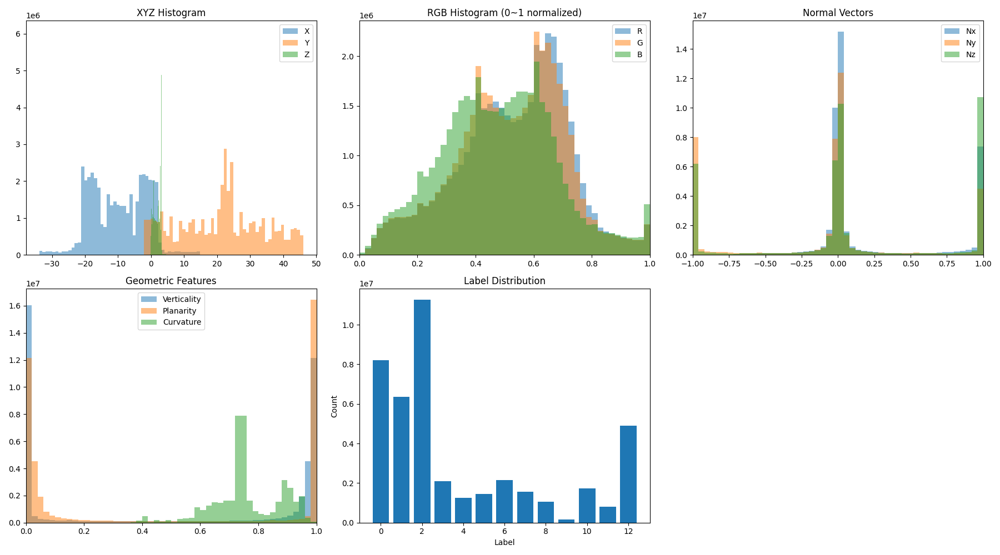</img>
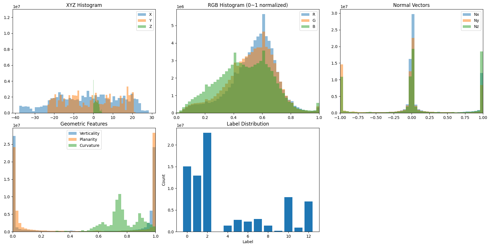</img>
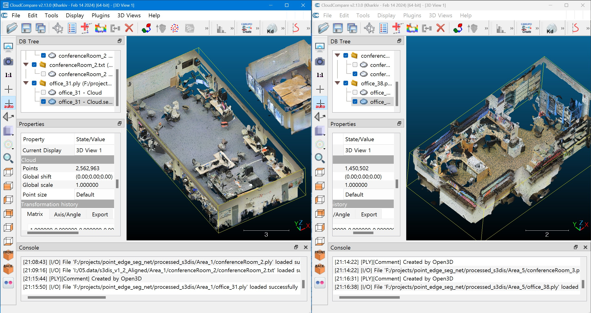</img>
</p>

## Contributing

Contributions are welcome! Please feel free to submit pull requests or open issues for bugs and feature requests.

## Author

- **Name**: Taewook Kang
- **Email**: laputa9999@gmail.com

## License

This project is released under the MIT License. See LICENSE file for details.

## Acknowledgments

- Stanford Vision Lab for the S3DIS dataset
- PyTorch Geometric team for the excellent graph neural network library
- Open3D team for 3D geometry processing tools
