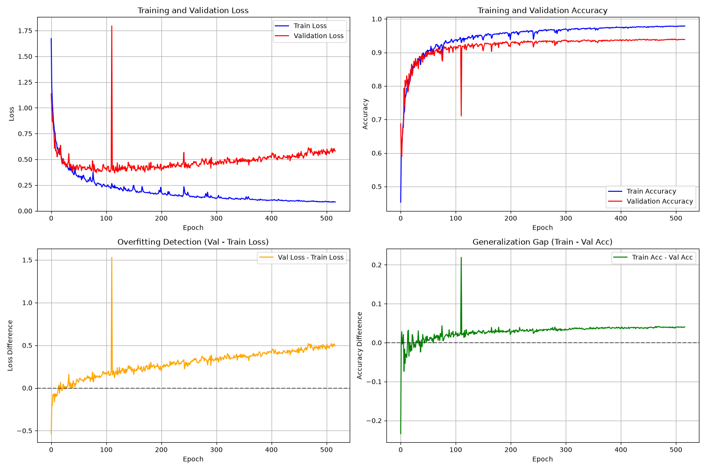

# Worked example: buildings (S3DIS)

Indoor building interiors, 13 classes, Area 5 held out for test. This is the example the
repository was originally built around; the bridge counterpart is
[bridge_example.md](./bridge_example.md). Both run the same code — what differs is the
dataset profile, the run recipe and the block geometry.

See the main [README](./README.md) for installation and the shared command surface.

---

## Performance Log

Latest (v2.0 architecture, `models/stencil.py`), S3DIS with Area 5 held out for test. Scoring uses the full-coverage protocol: every one of the 78.4M original points of Area 5 is predicted and scored (`evaluate_full.py`).

| Metric | Value |
|--------|-------|
| Mean IoU (mIoU) | **64.8%** (8-view TTA) / 64.2% single view |
| Overall Accuracy (OA) | **87.8%** |
| Mean Class Accuracy (mAcc) | **72.6%** |
| Parameters | ~3.0M |
| Training | 600-epoch schedule, ~2 min/epoch (~20 h total); measured ~12-20 GB steady (see Training with v2) |
| Inference GPU memory | ~4 GB, constant in cloud size (chunked) |

<p align="center">
</img></br>
Training curves and Area-5 test results, v1 vs v2 under the identical protocol.
</p>

<p align="center">
</img></br>
Inference example: Area 5 office_1 (816K points, held out from training), v2 architecture; 83.6% point accuracy on this room. Chunk mode and grid-preserving 8-view TTA are `evaluate_full.py` features (see [below](#tuning-the-scoring-knobs---core_max---halo)); `inference.py` uses column voting, so a figure produced by it is not directly comparable to the chunked Area 5 numbers above.
</p>

For reference, the v1 architecture re-scored under this same protocol reaches mIoU 58.8 — the published v1.1 figure (mIoU 59.99, `logs/20260715_204942`) used the earlier block-sampled protocol and is not directly comparable.

- [Train Model Performance (v2.0)](./logs/20260818_003229/training_summary.json)
- [Test Data Prediction Performance (v2.0, full coverage + 8-view TTA)](./logs/20260818_003229/test_full_final_d4tta.json)
- [Trained model and Log files (v2.0)](./logs/20260818_003229). Train/Val (spatial split) and Test on S3DIS v1.2 aligned.
- Previous baselines: v1.1 OA 86.60% / mAcc 69.73% / mIoU 59.99% ([logs/20260715_204942](./logs/20260715_204942)); v1.0 OA 86.16% / mAcc 69.05% / mIoU 59.57% ([logs/20260707_101907](./logs/20260707_101907))

Per-class IoU (Area 5, v2 + 8-view TTA, all 78,404,494 points scored):

| Class | IoU | Acc | Share of Area 5 GT |
|---|---|---|---|
| floor | 96.9 | 98.3 | 16.6% |
| ceiling | 91.5 | 94.7 | 19.4% |
| chair | 88.7 | 95.2 | 1.9% |
| wall | 81.6 | 93.2 | 29.3% |
| table | 80.4 | 90.9 | 3.8% |
| door | 70.6 | 83.7 | 3.0% |
| sofa | 70.3 | 78.1 | 0.3% |
| bookcase | 68.9 | 78.0 | 10.4% |
| board | 66.6 | 76.8 | 1.2% |
| clutter | 52.0 | 73.5 | 8.9% |
| **window** | **47.5** | 49.1 | 3.5% |
| **column** | **27.3** | 31.8 | 1.8% |
| **beam** | **0.0** | 0.0 | 0.03% |

Ten of the thirteen classes sit between 52 and 97; almost the entire remaining gap is three classes. Raising just `window`, `column` and `beam` to 60 IoU each would put mIoU at 72.9. `beam` is not a tuning problem — Area 5 ground truth contains 22,424 beam points (0.029%), and a 3.0 loss weight left it at 0.0 — while `column` resisted both a wider receptive field and directional gating (see VERSIONS.md, E8/E10).

<p align="center">
</img></br>
Training curves of the v2.0 run (logs/20260818_003229, 600 epochs).
</p>

---

## Where it stands (S3DIS Area 5)

Accuracy alone does not decide whether a model is usable on your own data. Three practical criteria matter as much: **Install** (pip wheels vs compiled C++/CUDA extensions), **Custom data** (own classes without rewriting dataset code), and **Large clouds** (a documented path from a 100M+ point raw scan to training/inference).

**This model** — the reference row every trade-off below is measured against:

| Model | mIoU | mAcc | Params | Install | Custom data | Large clouds |
|---|---|---|---|---|---|---|
| **PointEdgeSegNet v2 (2026)** | **64.8** | **72.6** | **3.07M** | ✓ pip only | ✓ JSON config + `convert_dataset.py` | ✓ chunking, voting, LAS output |

**More accurate, but you pay for it** — every mIoU point above is bought with compiled extensions, heavier preprocessing, bigger models, or multi-GPU recipes:

| Model | mIoU | Params | Install | Custom data | Large clouds | Cost of the extra accuracy |
|---|---|---|---|---|---|---|
| Point Transformer V3 (2024) | 73.4 | ~46M | ✗ spconv + flash-attn + pointops | ✗ Pointcept dataset class | △ no raw-cloud guide | heaviest dependency stack; official recipe is multi-GPU |
| PointNeXt-XL (2022) | 70.5 | ~42M | ✗ CUDA ops (openpoints) | △ S3DIS-centric | ✗ | 14x this model; score depends on heavy training recipe |
| Superpoint Transformer (2023) | 68.9 | ~0.8M | △ geometric-partition dependencies | △ partition parameters need tuning | ✓ superpoint partition scales to large scenes | the one row that is both smaller and more accurate; accuracy rides on partition quality |
| KPConv (2019) | 67.1 | ~15M | ✗ C++ wrappers | △ code-level work | △ heavy preprocessing | 5x this model; reprojection step for full-density output |
| MinkowskiNet (2019) | 65.4 | ~38M | ✗ MinkowskiEngine build | △ code-level work | △ depends on voxel size | closest row above (+0.6); the engine build is the usual blocker |

**Simpler era, lower accuracy** — what this model replaces:

| Model | mIoU | Params | Why not |
|---|---|---|---|
| RandLA-Net (2020) | ~62.5\* | ~1.2M | random sampling drops thin objects; official code TF1.x |
| SPG (2018) | 58.0 | ~0.3M | unmaintained since ~2019; partition errors propagate |
| PointNet++ (2017) | ~53.5\* | ~1M | dated accuracy; slow FPS/ball-query on large clouds |
| DGCNN (2018) | ~48\* | ~1M | kNN memory forces small blocks; no large-cloud pipeline |

\* Commonly reproduced figures; not reported for Area 5 in the original papers.

Only this project's row is measured here — every other mIoU is the published figure, scored under that method's own protocol rather than the full-coverage protocol used above. Parameter counts are the commonly cited figures for each method's reference configuration and differ between paper and public implementations; the 3.07M is counted from the released checkpoint.

The remaining gap to the rows above (0.6 mIoU to MinkowskiNet, 2.3 to KPConv, 8.6 to PTv3) is an operator/compute trade — every method above also chunks, samples, or voxelizes large scenes; the difference this project aims at is keeping installation, custom data, and the large-cloud path simple while closing that gap. Per the per-class table, nearly all of that gap is concentrated in three classes rather than spread across the label set.

---

## Stanford 3D Indoor Spaces Dataset (S3DIS)

1. Download the S3DIS dataset from [Stanford Vision Lab](https://cvgl.stanford.edu/resources.html) and [point cloud storage](https://sdss.redivis.com/datasets/9q3m-9w5pa1a2h/files)
2. Extract the dataset to `./s3dis_v1.2_aligned/` directory
3. Run data preprocessing with input_path, output_path arguments:

```bash
# S3DIS preprocessing with default configuration
python data_preparation.py --config model_params.json

# Custom data preparation with specific areas
python data_preparation.py --config model_params.json \
    --s3dis_path ./s3dis_v1.2_aligned \
    --save_path ./processed_s3dis \
    --areas Area_1 Area_2 Area_3
```

The preprocessing script will:
- Convert raw point cloud data to PyTorch Geometric format. You can download [the converted point cloud and PLY files](https://drive.google.com/drive/folders/1QdISVNKUnVrUVxugQrmezWmNuL78ZXoq)
- Calculate geometric features (normals, curvature)
- Split data into 8192-point blocks for efficient training
- Save processed data to `./processed_s3dis/`

---

## Supported Classes

#### S3DIS Dataset (Default Configuration)

The default model supports 13 semantic classes for indoor scene segmentation:

| Class ID | Class Name | RGB Color | Color Name | Hex Code |
|----------|------------|-----------|------------|----------|
| 0 | ceiling | (233, 229, 107) | Light Yellow | #E9E56B |
| 1 | floor | (95, 156, 196) | Light Blue | #5F9CC4 |
| 2 | wall | (179, 116, 81) | Brown | #B37451 |
| 3 | beam | (241, 149, 131) | Light Coral | #F19583 |
| 4 | column | (81, 163, 163) | Teal | #51A3A3 |
| 5 | window | (223, 160, 168) | Light Pink | #DFA0A8 |
| 6 | door | (142, 86, 114) | Dark Pink | #8E5672 |
| 7 | table | (153, 223, 138) | Light Green | #99DF8A |
| 8 | chair | (149, 149, 241) | Light Purple | #9595F1 |
| 9 | sofa | (107, 229, 233) | Cyan | #6BE5E9 |
| 10 | bookcase | (233, 107, 229) | Magenta | #E96BE5 |
| 11 | board | (107, 233, 107) | Bright Green | #6BE96B |
| 12 | clutter | (160, 160, 160) | Gray | #A0A0A0 |

**Color Scheme Design:**
- **Structural elements** (ceiling, floor, wall): Natural tones (yellow, blue, brown)
- **Architectural features** (beam, column, window, door): Warm and cool contrasts
- **Furniture** (table, chair, sofa, bookcase): Vibrant colors for easy identification
- **Functional items** (board): Bright green for visibility
- **Miscellaneous** (clutter): Neutral gray

#### Custom Dataset Classes

You can define your own classes in `model_params.json`. For example, an outdoor scene configuration:

| Class ID | Class Name | RGB Color | Description |
|----------|------------|-----------|-------------|
| 0 | ground | (139, 69, 19) | Ground surface |
| 1 | building | (255, 0, 0) | Building structures |
| 2 | tree | (0, 255, 0) | Trees and vegetation |
| 3 | vehicle | (0, 0, 255) | Cars, trucks, etc. |
| 4 | road | (128, 128, 128) | Road surfaces |
| 5 | vegetation | (34, 139, 34) | Low vegetation |
| 6 | pedestrian | (255, 255, 0) | People |
| 7 | others | (128, 0, 128) | Miscellaneous objects |

**Tips for Defining Custom Classes:**
1. Choose distinct RGB colors for easy visual discrimination
2. Set `class_weights` based on class frequency (higher weights for rare classes)
3. Adjust `grid_resolution` based on scene scale (smaller for indoor, larger for outdoor)
4. Set `grid_min_coords` to normalize your coordinate system

---

## S3DIS dataset Characteristics

The S3DIS dataset is not uniform. Each of the 6 areas, sourced from 3 different buildings, has a unique size, layout, and purpose. This leads to significant variations in point cloud size and class distribution. A precise statistical breakdown per area is not officially provided and requires manual data analysis.

| Area | Building Source | Primary Room Types | Expected Characteristics |
| :--- | :--- | :--- | :--- |
| **Area 1** | Building 1 | Offices, conference rooms, hallways | High density of furniture (`table`, `chair`, `bookcase`). |
| **Area 2** | Building 2 | Lounge, hallways, offices | Similar to Area 1, but with a potentially higher proportion of `sofa`. |
| **Area 3** | Building 1 | Open spaces, hallways, restrooms | Dominated by structural elements (`wall`, `floor`, `ceiling`); sparse furniture. |
| **Area 4** | Building 2 | Offices, hallways, storage areas | Similar characteristics to other office-centric areas. |
| **Area 5** | Building 3 | Auditorium, lobby, offices, hallways | The most diverse area; likely the largest point cloud. In example, high chair count due to the auditorium. Frequently used as a test set. |
| **Area 6** | Building 1 | Hallways, offices, pantry | Office-centric distribution, similar to Area 1. |

#### Pros

* **Realistic Diversity**: The variation mimics real-world scenarios where models must adapt to different environments.
* **Robustness Testing**: The distinct nature of each area provides an excellent framework for testing a model's generalization capabilities.

#### Cons

* **Data Imbalance**: The dataset has a significant class imbalance not only overall but also within and between areas.
* **Evaluation Bias**: Testing on a single area (e.g., Area 5) can lead to a misleading evaluation of a model's performance, as it may be over-fitted to the specific objects and layouts of the training areas.

To ensure a robust evaluation, consider the following:

* **Use 6-Fold Cross-Validation**: The standard evaluation protocol for S3DIS is **6-fold cross-validation**. You train on 5 areas and test on the remaining one, repeating this process for all 6 areas. This ensures the model is evaluated against all environmental types.

* **Be Aware of Bias**: A model's performance on a specific hold-out area is heavily influenced by the composition of the training areas. For instance, if you test on Area 5, but none of the training areas had a similar space like an auditorium, the performance on certain classes might suffer.

* **Consider Data Augmentation**: Employ data augmentation strategies that account for the dataset's diversity. This can help the model generalize better by creating more balanced exposure to different types of environments and objects.

---

## Tuning the scoring knobs (`--core_max`, `--halo`)

Chunks are scored core-only: `indices[:num_core]` are the points that get a label and the rest
is context the network sees but is never scored on. The budget for that context is
`block_size - core_max`, and a halo ring holding more points than the budget is **randomly
subsampled** (`voxel_chunk.chunk_with_halo`). Two consequences, both measured on Area 5 with
the released checkpoint and 8-view TTA:

| `--core_max` | `--halo` | halo budget | mIoU | scoring time |
|---|---|---|---|---|
| 12288 | 1.0 | 8,192 | 64.79 | 1.0x |
| 12288 | 1.5 | 8,192 | 64.67 | 1.0x |
| 10240 | 1.0 | 10,240 | 64.93 | 1.0x |
| 8192 | 1.0 | 12,288 | 65.01 | 1.15x |
| **6144** | **1.5** | **14,336** | **65.19** | 1.7x |

- **Lower `core_max` is better** up to the point where the extra cost stops paying: it enlarges
  the context budget, and that gain is independent of TTA so it carries over in full.
- **`halo` 1.5 m is the optimum for this data, but only when the budget can hold it.** At
  `core_max 12288` a wider ring is mostly subsampled away, and it scores *worse* than 1.0
  (64.67 vs 64.79) even though it looks better without TTA — a reminder to confirm any
  single-view finding at the TTA setting you actually publish.

Repeat spread is 0.01 mIoU single-view and 0.00 at 8 views, so these differences are real.
`sweep_eval.py` + `sweep_eval.json` reproduce the whole grid.

These two knobs belong to `evaluate_full.py --mode chunk`. `inference.py` segments a new cloud
through the *column* path (`--column_window` / `--column_stride`) and has no `--core_max` or
`--halo`, so the gains above do not currently carry over to it.

---

## Ensembling checkpoints

Both `evaluate_full.py` and `inference.py` accept the same two flags:

```bash
# members share this command line's architecture
python evaluate_full.py --model_weights logs/A/final_model.pth --ensemble logs/B/final_model.pth ...

# members declare their own architectures (required to mix, e.g., a --v2_directional
# checkpoint with an isotropic one)
python evaluate_full.py --ensemble_config ensemble_example.json ...
```

Member softmaxes are averaged (per-member `weight` in the JSON is honoured). On Area 5 with
the tuned scoring knobs above, a three-checkpoint ensemble reaches **mIoU 66.32 / OA 88.54**
versus 65.19 for the best single checkpoint — at 3x the scoring cost, and *not* comparable to
the single-model figures other methods publish.

---

## Common Run Scenarios

**Scenario 1: Quick Test Run**
```bash
# Minimal training for testing (5 epochs)
python train_model.py --num_epochs 5 --batch_size 2

# Quick inference test
python inference.py --no_visualization
```

**Scenario 2: Production Training**
```bash
# Full training with optimal settings
python train_model.py --num_epochs 50 --batch_size 8 --learning_rate 0.0005
```

**Scenario 3: Batch Processing**
```bash
# Process multiple files without visualization
for file in ./test_scenes/*.txt; do
    python inference.py --input_cloud "$file" --no_vis
done
```

**Scenario 4: Memory-Constrained Training**
```bash
# Reduce memory usage with smaller batch size and block size
python train_model.py --batch_size 2 --block_size 4096
```

---

## Training Performance

- Training Time (v2.0): ~2 min/epoch, ~20 hours for the 600-epoch schedule (batch 4, block 20480)
- GPU Memory (v2.0, measured): ~12-20 GB steady during training; ~8-10 GB at `--batch_size 2`
- For reference, the v1.1 run measured avg ~17.2 GB / peak ~18.7 GB whole-GPU and ~3 hours for 60 epochs (wandb system metrics; BATCH_SIZE=10, EdgeConv k=32, effective batch 60 via gradient accumulation)
- Scales to arbitrarily large training sets — memory is per block, not per scene

---

## Inference Performance

- Coverage-guaranteed column voting: every point of a large/dense cloud is predicted (no drop-to-`ceiling`)
- Optional TTA and model ensembling for extra accuracy at no extra VRAM
- Memory Efficiency: processes 100M-point clouds block by block; outputs colored LAS + TXT

---

## Insight
When training point cloud data, it's crucial to assume all data characteristics. Inputs that deviate from these assumptions will not yield good results (e.g., indoor vs. outdoor, bright vs. dark lighting, and variations in label object types and features). In Example of S3DIS dataset, The Area 1 (Train) and Area 5 (Test) datasets are representative examples. Because these two datasets exhibit such high variation, standard training alone won't significantly improve Test Acc. This consideration must be taken into account when designing the model to determine which data features to train. Statistical analysis must be performed first to ensure inductive inference, a golden rule in deep learning model training. When I tried to improve the performance (accuray, loss) of test dataset (unseen), I used some solutions like the argumented dataset with features, model size increasement within the memory budget of that time etc, but the performance was limited. Local features acceptance is always an issue in tranining model becuase it's difficult to increase the model size and architecture in usecase under the small VRAM.

Update (v1.0): several of these limits were pushed back without any hardware upgrade — context-preserving column blocks, per-block coordinate centering (translation invariance), an mIoU-aware Lovász+Focal loss, a corrected surface-variation curvature feature, and a fixed coverage-guaranteed voting pipeline together raised held-out Area 5 from ~mIoU 49 to **59.6** (OA 86.2%); fixing a silent AMP GradScaler bug and retraining (v1.1) pushed this to **mIoU 60.0** (OA 86.6%). The remaining bottleneck is long-range context between blocks and the two rarest classes (`column`, `sofa`); closing the gap to sparse-conv/transformer methods (65–70+) is an *architecture* problem (a different convolution/attention operator), not a VRAM one — all such methods still chunk or down-voxelize large clouds rather than fitting them whole.

Update (v2.0): that prediction held. Replacing the operator — kNN EdgeConv out, voxel-stencil aggregation in — moved Area 5 to **mIoU 64.8 / OA 87.8** on the full-coverage protocol (+4.8 over v1.1 re-scored the same way) while *lowering* both training memory and epoch time. `column` and `beam` are still the weakest classes, and long-range context between blocks is still the open problem.

---
